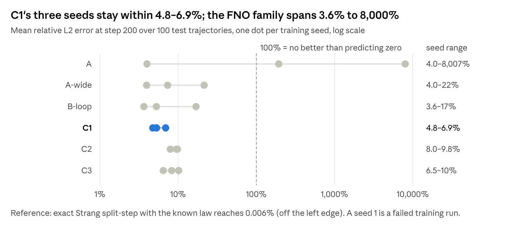
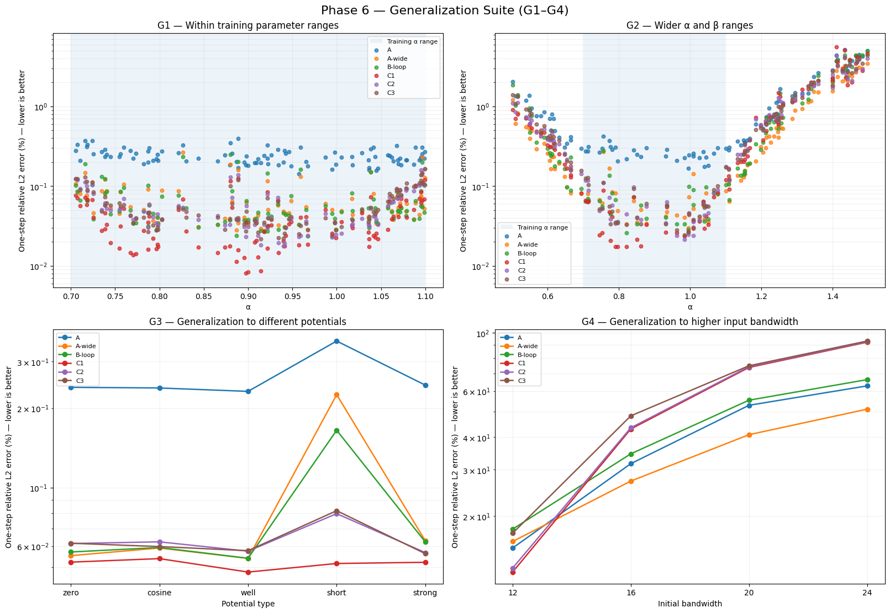
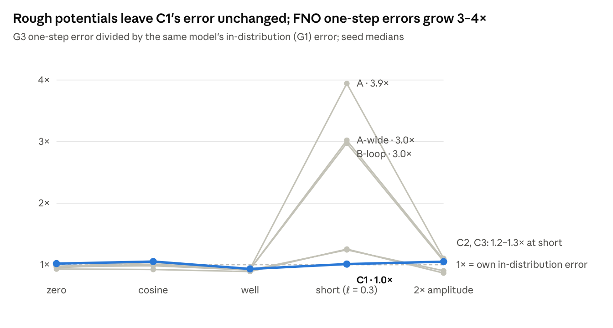
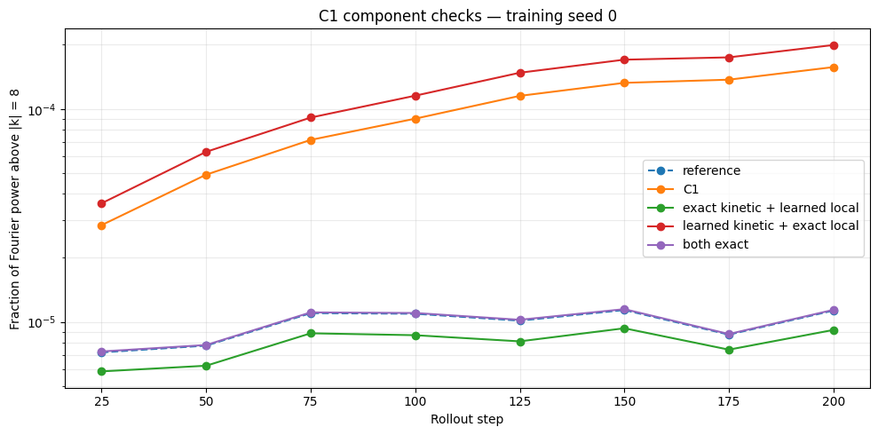

# Small by Structure — Paper Draft v1

Oct 1, 2026 · @omer mazal

**Title:** *Small by Structure: A 2.5k-Parameter Learned Split-Step Operator for the Nonlinear Schrödinger Equation, and Where Its Inductive Bias Ends*

## Abstract

Neural operators such as the Fourier Neural Operator (FNO) learn PDE time-steppers as black boxes with hundreds of thousands of parameters. We ask what building the known structure of a PDE family into the operator buys, and what it costs. For the parametric 1D cubic nonlinear Schrödinger equation (NLS), we compare the standard 1D FNO configuration (~550k real parameters) with C1. C1 is a learned Strang splitting whose kinetic rate κ(\|k\|²) and local phase ν(\|ψ\|², V) are small MLPs, 2,466 parameters in total. By construction it conserves mass exactly and is time-reversible, symplectic and U(1)-equivariant.

At a fixed training budget, C1 reaches one-step error comparable to the FNO baselines (0.050% vs 0.054–0.059%) with 223× fewer parameters. Its 200-step rollouts are close to the best FNO runs (median 3.7–5.7% vs 3.0–3.7%), and none of 300 test trajectories failed catastrophically. Mass is conserved to 5×10⁻¹⁴ and energy drift stays near 0.06%.

The clearest generalization gain is to potentials with unseen spatial structure: C1's error does not change, while FNO one-step errors grow 3–4×. Both model types work inside the trained spectral band and neither generalizes beyond it.

Because C1's components are explicit, we can read out and swap them. The learned dispersion law matches −αk² to slope 1.000 inside the excited band and saturates outside it. Replacing only the learned kinetic step with the exact one reduces phase-aligned error 14× in distribution and ~230× at higher bandwidths; replacing only the local step changes nothing. Every out-of-distribution failure of C1 is therefore localized in a 1,217-parameter component and traced to the spectral support of the training data.

## 1. Introduction

Neural operators learn maps between function spaces and have become standard surrogates for time-dependent PDEs. The FNO in particular parameterizes global convolutions in Fourier space and is typically trained as an unconstrained one-step map. Its flexibility comes with hundreds of thousands of parameters, no conservation guarantees, and failures that are hard to diagnose.

For Hamiltonian PDEs such as the NLS, numerical analysis offers a different template. Split-step Fourier methods separate a linear dispersive flow, diagonal in Fourier space, from a nonlinear local flow, pointwise in physical space. Composing the two preserves the L² norm, is time-reversible and is symplectic. We ask a simple question: **if we keep that template and learn only the two rates, how small can the model be, and what does the structure buy and cost relative to an FNO?**

This is a question about *inductive bias*, not about beating a known solver. With the true equation known, the exact split-step method is three orders of magnitude more accurate than any learned model here. The motivation is settings where the rates are unknown or only partly known, and where a model must be trusted outside its training data.

**Contributions.**

1.  **A 2,466-parameter learned split-step operator (C1)** that is exactly mass-conserving, reversible, symplectic and U(1)-equivariant for any weights. At a fixed budget its one-step error is comparable to the standard ~550k-parameter 1D FNO and its rollouts are close, with no catastrophic failures.

2.  **A controlled baseline ladder** separating architectural structure from constraint projection and physics losses: an unconstrained FNO (A), an FNO without mode truncation (A-wide), an FNO with in-loop mass projection (B-loop), a capacity-matched structured model (C2), and a mass-only control (C3).

3.  **A generalization suite** (G1–G9) that separates parameter, potential, spectral and time-step shifts. C1 is robust to unseen potential structure and does not extrapolate beyond the trained spectral band.

4.  **A component-level identifiability analysis.** We read the learned dispersion law directly from the weights and swap learned components for exact ones. This localizes every out-of-distribution failure in the kinetic component and ties it to the training data's spectral support.

## 2. Related work

**Neural operators and their usual size.** The FNO ([Li et al., 2020](https://arxiv.org/pdf/2010.08895v2)) stacks four Fourier layers. For 1D problems the original paper sets 16 retained modes and 64 channels ("k_max,j = 16, d_v = 64 for the 1-d problem"). That is exactly our Model A, about 288k PyTorch parameters or ~550k real scalars once complex spectral weights are counted twice. The same paper reports 414,517 parameters for its 2D FNO on Navier–Stokes. Benchmarks such as [PDEBench](https://arxiv.org/pdf/2210.07182) follow "the original implementation, hyperparameters, and training protocols". **Our FNO baseline is therefore the standard published 1D configuration, not an inflated one.** We do not, however, claim that this size is necessary; see §7.

**Physics losses and projections.** Physics-informed neural operators (PINO) \[cite\] add a PDE residual to the data loss; Phase 7 of this project tests that route (§5.5). Constraint projection, such as rescaling to the input mass, enforces a single invariant after the fact. We include both as baselines, so that "architecture" is not confounded with "any physics at all".

**Structure-preserving networks.** Symplectic and Hamiltonian networks ([SympNets](https://arxiv.org/abs/2001.03750); Hamiltonian neural networks \[cite\]) and, recently, [symplectic neural operators](https://arxiv.org/abs/2605.15881) build geometric structure into the learner. C1 belongs to this family but is specialized: it inherits its structure from a classical integrator rather than from a generic symplectic layer.

**Learned split-step methods.** The closest prior work comes from fiber-optic communications. *Learned digital backpropagation* trains split-step Fourier steps for the NLS end to end, with learned linear filters and nonlinear steps ([Häger & Pfister, 2018](https://arxiv.org/pdf/1804.02799); [Physics-Based Deep Learning for Fiber-Optic Communication Systems](https://research.chalmers.se/en/publication/521455)). Our architecture is close in spirit. What differs is the setting: a parametric operator-learning benchmark with distribution shifts, against FNO baselines. So does the analysis: a direct dispersion readout, an α-derivative identifiability probe, and component swaps.

## 3. Problem setup

We learn the one-step map ψ(t) → ψ(t + dt) of the periodic 1D cubic NLS with an external potential, conditioned on the parameters (V, α, β):

i\\\partial_t \psi = -\alpha\\\partial\_{xx}\psi \\-\\ \beta\\\|\psi\|^2\psi \\+\\ V(x)\\\psi, \qquad x \in \[0, 2\pi)

Plane waves of amplitude A obey ω(k) = αk² − βA² + V₀. The flow conserves the mass M = ∫\|ψ\|² and the Hamiltonian H = ∫(α\|ψₓ\|² − ½β\|ψ\|⁴ + V\|ψ\|²).

**Data.** Grid N = 64 (integer wavenumbers, Nyquist 32), dt = 0.01, trajectories of 200 steps (t = 2). Ground truth comes from a Strang split-step solver with 32 substeps per dt. Parameters are α ∈ \[0.7, 1.1\] and β ∈ \[−0.4, 0.6\]. V is a random field with amplitude in \[0, 0.5\] and correlation length 1, and the mass is in \[1, 3\]. Initial conditions are band-limited to \|k\| ≤ 8; nonlinear transfer moves only ~10⁻⁵ of the energy above \|k\| = 8 within the horizon, and ~2.5×10⁻⁸ above \|k\| = 15. The split is 800 / 100 / 100 trajectories (160k / 20k / 20k one-step pairs). The phase-wrapping wavenumber k_wrap = √(π/(α dt)) lies between 16.9 and 21.2.

**Training.** All models minimize one-step relative L² with AdamW (lr 10⁻³, weight decay 10⁻⁴), batch 256, gradient clipping 1, a cosine schedule, 40 epochs, patience 8, and best-validation checkpoint selection. Three seeds per model. Training is in float32; every invariant and rollout is evaluated in float64.

**Metrics.**

- One-step relative L² on all 20k test pairs.

- Autoregressive rollout relative L² at step 200, reported as per-trajectory medians, tail counts (\> 10%, \> 100%) and per-seed means.

- Relative mass and energy drift.

- Phase-aligned error (optimal global phase removed).

- Spectral energy transfer above \|k\| = 8.

- A direct readout of learned rates where the architecture allows it.

**Distribution shifts (G1–G9).** All evaluation-only unless noted.

| Arm       | Shift                                                                                  | Type                              |
|-----------|----------------------------------------------------------------------------------------|-----------------------------------|
| G1        | Fresh draw, same ranges                                                                | Interpolation                     |
| G2        | α ∈ \[0.5, 1.5\], β ∈ \[−0.5, 0.8\]                                                    | Parameter extrapolation           |
| G3        | Five potential families: zero, cosine, well, short correlation (ℓ = 0.3), 2× amplitude | Potential structure and amplitude |
| G4        | Initial bandwidth 12, 16, 20, 24                                                       | Spectral extrapolation            |
| G5a / G5b | Plane-wave dispersion probe at fixed α / α-derivative                                  | Identifiability                   |
| G6a / G6b | Multi-dt training / dt transfer                                                        | Time step                         |
| G7        | Retrain with α fixed                                                                   | Conditioning ablation             |
| G9        | Energy cascade into initially empty modes                                              | Nonlinear spectral fidelity       |

## 4. Models

**C1: learned Strang splitting.** One step is a symmetric composition of a learned kinetic half-step and a learned local step:

\Phi\_{dt} = K\_{dt/2}\circ N\_{dt}\circ K\_{dt/2},\quad K\_{\tau}:\hat\psi_k \mapsto e^{i\tau\\\kappa\_\theta(k^2,\alpha,\beta)}\hat\psi_k,\quad N\_{\tau}:\psi \mapsto e^{i\tau\\\nu\_\theta(\|\psi\|^2,V,\alpha,\beta)}\psi

κθ and νθ are real-valued tanh MLPs (width 32, depth 3) with 1,217 and 1,249 parameters. The truth would be κ = −αk² and ν = βρ − V. In the headline variant (K0/L0) neither product is given: the network must discover αk² from (k², α, β) and βρ from (ρ, V, α, β).

For **any** weights, including at initialization:

1.  Mass is exactly preserved: both substeps are unit-modulus multipliers and the FFT is unitary.

2.  Φ(−dt) ∘ Φ(dt) = Id exactly, because N leaves ρ unchanged.

3.  Φ is the Strang splitting of a learned Hamiltonian, so it is symplectic.

4.  It is U(1)-equivariant.

The step also takes dt as an argument, so a trained model can be run at an untrained dt. The FNO cannot.

**What C1 cannot represent:** nonlocal or derivative nonlinearities, anisotropic or position-dependent dispersion, non-norm-preserving dynamics (gain, loss, forcing), and, with finite weights, a kinetic rate outside the range its bounded tanh head can reach.

**Baselines.**

| Model  | Description                                                                 | Real parameters | Built-in structure                       |
|--------|-----------------------------------------------------------------------------|-----------------|------------------------------------------|
| A      | Standard 1D FNO: 4 layers, 16 modes, width 64; inputs (Re ψ, Im ψ, V, α, β) | 549,890         | none                                     |
| A-wide | A with 32 modes (to Nyquist); removes mode truncation                       | 1,074,178       | none                                     |
| B-loop | A with output rescaled to the input mass, trained through the projection    | 549,890         | mass (projection)                        |
| C1     | Learned split step, pointwise local MLP                                     | **2,466**       | mass, reversibility, symplecticity, U(1) |
| C2     | Split step, local phase from an FNO on (ρ, V, α, β)                         | 550,914         | mass, reversibility, U(1)                |
| C3     | Split step, local phase from an FNO on (Re ψ, Im ψ, …)                      | 550,978         | mass only (reversible to second order)   |
| Strang | Exact split-step with the known law                                         | —               | reference, not a learner                 |

We count real scalars; PyTorch counts each complex spectral weight once, which gives A 287,746. Ratios in the text are C1 vs A in real parameters (223×; 117× on PyTorch counts). Our estimated cost per step is ~0.15M multiply-adds plus 4 length-64 FFTs for C1, against ~2.7M plus 8 64-channel FFTs for A. We have not timed inference.

## 5. Results

### 5.1 In-distribution accuracy at 1/223 the size

**C1 is competitive with the standard FNO at a small fraction of its size.** Its one-step test error is 0.050%, against 0.054% for B-loop and A-wide and 0.056–0.059% for A's two healthy seeds. It reaches this with 2,466 parameters, after ~0.1 h of training per seed against ~0.8–1.3 h for the FNOs.

| Model              | Real params | One-step test error | Val. loss (seed mean) |
|--------------------|-------------|---------------------|-----------------------|
| C1                 | 2,466       | **0.050%**          | 5.2×10⁻⁴              |
| B-loop             | 549,890     | 0.054%              | 5.9×10⁻⁴              |
| A-wide             | 1,074,178   | 0.054%              | 5.9×10⁻⁴              |
| A (seeds 0, 2)     | 549,890     | 0.056–0.059%        | 6.3×10⁻⁴              |
| C2                 | 550,914     | 0.062%              | 6.0×10⁻⁴              |
| Strang (known law) | —           | 0.0055%             | —                     |

Figure 1 · frozen-test/summary.json · 3 seeds × 100 held-out trajectories

Over 200 autoregressive steps, C1's seeds stay within a narrow band, while the FNO family ranges from healthy to catastrophic (Figure 1). Per trajectory, C1 is close to but slightly behind the best FNO runs:

| Step-200 error, 100 trajectories per seed | C1               | B-loop           | A-wide           | A (seeds 0, 2 only) |
|-------------------------------------------|------------------|------------------|------------------|---------------------|
| Median (seeds 0 / 1 / 2)                  | 5.7 / 4.1 / 3.7% | 3.0 / 3.0 / 3.7% | 3.5 / 3.4 / 3.0% | 3.5 / — / 3.6%      |
| Trajectories \> 10% (of 300)              | 40               | 27               | 24               | 13 (of 200)         |
| Trajectories \> 100% (of 300)             | **0**            | 5                | 5                | 7 (of 200)          |

The typical C1 rollout is therefore within ~1.2–1.9× of the best FNO run per seed, and C1 is the only learned model without a catastrophic tail. Training with three time steps (multi-dt) lowers C1's median to 2.6–3.2%, on par with the best model (C2 multi-dt, 2.1–3.3%), but that run used 3× the gradient updates (§7).

**Replication at an earlier, shorter budget (Phases 4–5).** An independent run on the same data (config bd4e108527, one-step objective, K0/L0) gives the same one-step picture. It trained for fewer epochs \[confirm: epochs and seeds from the Phase 4–5 log\]. Errors are measured at step 100; "/ε" is one-step error divided by the error of one exact Strang step, ε_split ≈ 6.2×10⁻⁵.

| Model  | Real params | One-step  | / ε  | Rollout @100 | Mass drift @100 | Energy growth exponent | Reversibility |
|--------|-------------|-----------|------|--------------|-----------------|------------------------|---------------|
| A      | 549,890     | 6.55×10⁻⁴ | 10.5 | 2.5%         | 1.5%            | 0.97                   | n/a           |
| B-loop | 549,890     | 6.19×10⁻⁴ | 9.9  | 2.2%         | 1.2×10⁻¹⁵       | 0.87                   | n/a           |
| C1     | 2,466       | 6.52×10⁻⁴ | 10.4 | 4.7%         | 1.0×10⁻¹⁴       | **0.49**               | exact         |
| C2     | 550,914     | 9.84×10⁻⁴ | 15.8 | 8.1%         | 1.1×10⁻¹⁴       | 0.42                   | exact         |
| C3     | 550,978     | 9.30×10⁻⁴ | 14.9 | 6.8%         | 1.1×10⁻¹⁴       | 0.60                   | approximate   |

Three observations carry over to the main run:

- C1 matches A's one-step error to within 0.5% with 223× fewer parameters.

- The capacity-matched structured models C2 and C3 are ~50% *worse* than both at this budget. Adding capacity back into the split structure slows optimization rather than helping.

- The energy-drift growth exponent (log-log slope against time) is ~1 for the FNOs, meaning linear secular drift, and ~0.4–0.6 for the split models. All models are still classified as secular over 100 steps, so the split structure slows energy drift but does not yet show bounded behaviour.

One difference matters. At this shorter budget C1's step-100 rollout (4.7%) was about 2× the FNOs' (2.2–2.5%). In the longer Phase 6 run the gap closed to 2.9% vs 2.3–2.5% (§5.5). Longer training improved C1's one-step error by about a quarter (6.5 → 5.0×10⁻⁴) and its rollout error by about 40%.

*Figure 2 · Mean rollout error over all test trajectories and seeds; dashed line: exact Strang. A's mean is dominated by its failed seed.*

### 5.2 Rollout stability and physical invariants

**C1 holds its invariants exactly and keeps energy error 15–110× below the projected FNO.**

| At step 200 (IID test)         | C1         | C2         | B-loop    | A (seed 0) | A-wide   | Strang    |
|--------------------------------|------------|------------|-----------|------------|----------|-----------|
| Mass drift                     | 4.8×10⁻¹⁴  | ~5×10⁻¹⁴   | 1.8×10⁻¹⁵ | 2.3%       | 0.2–126% | 4.8×10⁻¹⁴ |
| Energy drift                   | 0.06–0.07% | 0.06–0.08% | 1.0–7.2%  | 2.9%       | 2.5–125% | 0.0007%   |
| Catastrophic rollouts (of 300) | 0          | 0          | 5         | 84         | 5        | 0         |

- **Mass.** C1 reaches the float64 floor of the exact solver. B-loop's lower number reflects an explicit rescaling, not better physics.

- **Energy.** C1's drift is 54× below B-loop's mean. C2, which is reversible but *not* symplectic, matches C1. We therefore attribute bounded energy to the reversible split structure, consistent with reversible-KAM behaviour, rather than to symplecticity specifically.

- **Stability.** The FNO family's catastrophic rollouts concentrate in a few runs: A seed 1 (early-stopped at epoch 13, 77 failures), A seed 2 (7), A-wide seeds 0 and 2 (3 and 2) and B-loop seeds 1 and 2 (1 and 4). C1 has none in any seed. Mass conservation alone (B-loop) does not remove them.

### 5.3 Generalization

*Figure 3 · One-step error under the four shift families. Model A's points average all three seeds and are dominated by its failed seed 1; its healthy seeds sit with the other FNOs.*

**G1 — interpolation: a small, consistent win.** On a fresh draw inside the training ranges, C1 has the lowest one-step error at almost every α, about 10–15% below B-loop and A-wide (0.052% vs 0.058%). Its rollouts are stable across seeds (4.8–7.0%), while each FNO variant has at least one seed above 9%.

**G2 — parameter extrapolation: on par, with better physics.** Outside the α box every model's one-step error climbs along the same curve, to 1–5% at α = 1.4; C1 is neither better nor worse (0.84% vs 0.67–1.03%). All mass-conserving models keep rollouts bounded (C1 66%, B-loop 65–83%, C2 66–74%), while A and A-wide diverge. C1's distinct advantage here is energy: 0.10% drift against 28% for B-loop.

**G3 — potential generalization: the clearest structural result.** The "short" family keeps V's amplitudes in range but gives it spatial structure at correlation length 0.3 instead of 1. C1's one-step error is unchanged (0.0509% → 0.0515%). B-loop and A-wide rise 3×, and the capacity-matched C2 and C3 rise 25%. Rollouts follow: C1 4.4–6.2% across seeds vs B-loop 4.5–21%. A-wide degrades as much as A, so the cause is not mode truncation. The mechanism is locality: C1 reads V pointwise, so the spatial arrangement of V is irrelevant to it, whereas every FNO-based model filters V globally with weights fitted to smooth potentials. C1 also extrapolates to 2× the training potential amplitude with a 5% increase.

Figure 4 · Phase6_all.ipynb G1/G3 summaries · medians over 3 seeds, 100 trajectories per arm

**G4 — higher input bandwidth: works within the trained band, no spectral extrapolation.** Training initial conditions are band-limited to \|k\| ≤ 8. Raising the input bandwidth places energy where the model has never seen dynamics.

| One-step error | bw 12   | bw 16   | bw 20   | bw 24   |
|----------------|---------|---------|---------|---------|
| C1             | **12%** | 43%     | 74%     | 92%     |
| A              | 14%     | 31%     | 53%     | 63%     |
| A-wide         | 15%     | **28%** | **41%** | **51%** |
| B-loop         | 18%     | 35%     | 56%     | 66%     |

C1 is marginally best at bandwidth 12; above it, the C family's error rises faster than the FNOs'. At these error levels no model is a useful predictor: FNO rollouts blow up (10⁸–10¹⁹), and C1's stay bounded but uninformative (60–103%). We read this as *no spectral generalization for any model*. §5.4 shows the C1 failure comes entirely from its kinetic component.

### 5.4 What C1 learned, and where its error lives

**Learned dispersion.** Because κθ is explicit, we can read the learned dispersion law straight from the weights. We compare κ(k) − κ(0), since a constant shift between κ and ν is a gauge freedom of the step: the trained models carry κ(0) ≈ −25 to −28, which the local net cancels.

Figure 5 · frozen-probes/kinetic-rate-bounds.json · base and multi-dt C1, 3 seeds each

| Fit of learned rate vs −αk² (6 checkpoints) | k ≤ 8         | k ≤ 32 |
|---------------------------------------------|---------------|--------|
| Slope                                       | 0.9996–1.0003 | 0.06   |
| Intercept                                   | ≤ 0.007       | −44    |
| Correlation                                 | 1.0000        | 0.61   |
| Max relative error                          | 0.1–1.1%      | 91%    |

Inside the excited band the law is quantitatively correct, with the right slope, no offset and no compression. It breaks sharply between k = 9 and k = 10 (13% error at k = 10, 39% at k = 12), identically across seeds and across single- and multi-dt training. Two factors coincide at that point. The training data carry almost no energy above k ≈ 9, so one-step loss barely constrains κ there. And a tanh MLP has bounded output: for these weights \|κ(x) − κ(y)\| ≤ 2‖w_out‖₁ ≈ 103, which cannot reach αk² beyond k ≈ 10.7 at α = 0.9.

The plane-wave identifiability probe (G5b) agrees and extends this to all models. The α-derivative of the one-step phase, which is free of phase-wrapping ambiguity, is recovered at k = 8 by every model (C1 4.9% error, B-loop 3.2%, A 7.3%; multi-dt C1 1.4%). At k ≥ 16 no model, A-wide included, carries any α-sensitivity (88–99% error). Unconstrained FNOs show the same in-band limitation; C1 is the model in which it can be seen.

**Component swaps.** We freeze a trained C1 and replace one learned half with the exact operator, after fixing the gauge. We then compare phase-aligned final-state error with paired bootstrap ratios (5 probe batches × 3 seeds).

| Test case                   | Exact κ + learned ν, relative to C1    | Learned κ + exact ν, relative to C1 |
|-----------------------------|----------------------------------------|-------------------------------------|
| In distribution             | 0.072 \[0.054, 0.096\] — 14× lower     | 1.00                                |
| α extrapolation only        | 0.028 — 36× lower                      | 1.00                                |
| β extrapolation only        | 0.083 — 12× lower                      | 1.00                                |
| Short-correlation potential | 0.071                                  | 1.00                                |
| Bandwidth 12 / 16 / 24      | 0.0043 / 0.0042 / 0.0045 — ~230× lower | 1.00                                |

With the exact kinetic step, C1's **learned** local law reaches 0.4–0.6% phase-aligned error at 1.5–3× the training bandwidth, where full C1 has 66–88%. Swapping the local half changes nothing in any case. The nonlinear component therefore generalizes, to unseen spectra, potentials and β. Its fitted law after gauge fixing is ν ≈ 0.95·βρ − 0.98·V, with a small spurious α-term. All of C1's out-of-distribution error, and most of its phase-aligned in-distribution error, sits in the 1,217-parameter kinetic MLP. The remaining raw error is mostly a global phase drift, which comes from the slightly underestimated nonlinearity (β_eff ≈ 0.9β).

**Spectral energy transfer (G9).** The same component explains C1's one clear physical-fidelity failure. C1 puts 14× too much energy into modes above \|k\| = 8 by step 200 (C2 12×; B-loop 1.2×; A-wide 0.75×). Learned κ + exact ν reproduces the excess (16–21× across seeds); exact κ + learned ν matches the reference (0.8×). High modes rotate at the saturated rate, too slowly, so energy fails to dephase out of them.

*Figure 6 · Fraction of Fourier power above \|k\| = 8 for C1 and its component swaps, seed 0 (α = 0.9, β = 0.3, V = 0, 8 probe fields). Seeds 1–2 are qualitatively identical.*

### 5.5 Architecture vs a physics loss

**A small physics loss stabilizes the FNO but does not give it invariants; on C1 it adds nothing.** We added a Crank–Nicolson residual to the training loss of A and C1, sweeping its weight λ (same data, seeds and protocol; error at step 100).

| Model    | λ    | One-step                     | Rollout @100 | Mass drift @100 | Energy drift @100 |
|----------|------|------------------------------|--------------|-----------------|-------------------|
| A        | 0    | 0.24% (failed seed included) | 20%          | 21%             | 13%               |
| A + PDE  | 0.01 | 0.057%                       | 2.5%         | 1.3%            | 1.6%              |
| A + PDE  | 1    | 0.25%                        | 23%          | 5.0%            | 4.5%              |
| C1       | 0    | 0.050%                       | 2.9%         | 1×10⁻¹⁴         | 0.036%            |
| C1 + PDE | 0.01 | 0.050%                       | 2.9%         | 1×10⁻¹⁴         | 0.035%            |
| B-loop   | 0    | 0.054%                       | 2.3%         | 2×10⁻¹⁵         | 0.64%             |

A mild residual (λ = 0.01–0.1) gives A healthy rollouts on all seeds, so the FNO's catastrophic rollouts are partly an optimization pathology rather than an inevitable property of the architecture. It still drifts in mass and energy by ~1–2% within 100 steps. Larger weights hurt both models (at λ = 10, A's rollout error reaches 62% and one seed's mass drifts by 34×). Note that the CN residual itself nearly conserves mass, so this loss partially smuggles in the invariant under study. Of the three routes to physics — loss, projection, architecture — only the architectural one delivers exact invariants with no accuracy cost.

## 6. Discussion

**What the structure buys.** The split template gives C1 four exact invariants for free and makes it small, fast to train (~0.1 h per seed) and free of catastrophic rollouts. Its accuracy stays comparable to a standard-size FNO. Its locality also gives a clean generalization gain: the nonlinear step is a pointwise function of (ρ, V), so it is indifferent to the spatial or spectral arrangement of its inputs. That is why C1 is unaffected by rough potentials (G3), and why its learned local law transfers to 3× the training bandwidth once the kinetic step is correct.

**What it does not buy.** Structure does not create information that is missing from the data. The training trajectories excite modes only up to k ≈ 9, and C1's dispersion law is correct exactly there and nowhere else. Our reading is that C1 *identifies* the components its inputs make observable, and nothing more. The FNOs fail at the same frequencies (G4, G5b), but invisibly: there is no component to inspect.

**Diagnosability as a result in itself.** The most useful property of C1 may be that its failures are attributable. A single swap experiment tells us that the nonlinear law is essentially right (0.95βρ − 0.98V), that the kinetic law is right in band and saturated outside it, and that the energy-cascade error comes entirely from that saturation. Any of these statements would require a new probing method for an FNO. For scientific use, where a model is trusted outside its training data, knowing *which part* fails is as valuable as a lower average error.

**One-step error is a poor proxy for rollout quality here.** C1 has the lowest one-step error and a slightly worse median rollout than the best FNO runs. Its errors are systematic (a fixed kinetic misfit, β_eff ≈ 0.9β), so they accumulate coherently over steps. Structured models should be selected and compared on rollout metrics, not on one-step validation loss alone.

**Reversibility, not symplecticity.** C2 is reversible but not symplectic, and it matches C1's energy behaviour. For this problem the reversible split structure, not symplecticity specifically, appears to be what slows energy drift. The earlier run's growth exponents (~0.5 vs ~1 for the FNOs) suggest slower-than-linear growth rather than strictly bounded energy over these horizons.

## 7. Limitations and future work

**Limitations of the current evidence.**

- **One FNO size.** We compare C1 with the standard 1D FNO configuration, but have no FNO near C1's size. "Comparable accuracy with 223× fewer parameters" is therefore a statement about C1 vs a standard baseline, not yet a parameter-efficiency curve. Doubling the FNO (A-wide) improved validation error by only ~6%, so a smaller FNO might lose little.

- **Fixed training budget.** All models trained for 40 epochs. C1 had plateaued (≤ 1% improvement over the last 5 epochs) while the FNOs were still improving 14–25%. One A seed early-stopped at epoch 13 with 9× higher validation loss and accounts for most of A's catastrophic rollouts.

- **Statistics.** Three seeds on one data split with a shared test set. We report per-seed and per-trajectory results and do not claim significance for differences under ~20% between non-failing models.

- **Multi-dt.** Its gains (C1 median 2.6–3.2%) come with 3× the gradient updates; at matched updates, multi-dt training is worse.

- **Oracle swaps.** The component-swap experiments use the exact kinetic operator. They diagnose where error lives; they are not a deployable model.

- **Gauge.** κ and ν are defined only up to a shared constant. Readouts and swaps are gauge-fixed post hoc; a gauge-identifiable variant (C1g, κ(0) = 0) is implemented but not yet trained.

- **Scope.** One PDE family in 1D. Resolution transfer, sample efficiency and misspecified dynamics (nonlocal or non-conservative terms) are implemented in our pipeline but not yet evaluated. No inference timing has been measured.

- **Known law.** When the equation is known exactly, the Strang solver is about 1,000× more accurate. The case for C1 rests on unknown or partially known dynamics.

**Next experiments.**

1.  **Size- and compute-matched comparison.** C1 at widths 8–64 (~0.2k–9k parameters) against FNOs, with and without mass projection, at ~2.5k, 9k, 50k and 550k. Equal updates, per-model learning rates, 5 seeds; median and p95 rollout error and catastrophic rate. Optionally vary the number of training trajectories (50, 200, 800) to measure sample efficiency.

2.  **Kinetic identifiability.** Training bandwidth {8, 12, 16} × kinetic head {tanh MLP; polynomial in k² with learned coefficients; K1}. Does the knee track the data's support, and can an extrapolating head recover −αk² to k = 32 from bandwidth-8 data without being given the αk² product?

3.  **Misspecification.** Add a nonlocal nonlinearity or gain/loss to the data-generating equation and locate where the FNO overtakes C1. Compare C1 with the analytic floor \|1 − e^{−γt}\| that any norm-preserving model must incur.

## 8. Conclusion

A learned Strang splitting with 2,466 parameters reaches one-step accuracy comparable to the standard ~550k-parameter 1D FNO on the parametric NLS. Its rollouts are close to the best FNO runs, it has no catastrophic failures, and it conserves mass exactly with ~0.06% energy drift. Its locality makes it robust to unseen potential structure, where FNO errors triple to quadruple. Like the FNO, it does not generalize beyond the trained spectral band. Unlike the FNO, it shows exactly why: the learned dispersion law is correct where the data excite it and saturates beyond, while the learned nonlinear law transfers. We see that decomposability — knowing which part of a learned operator to trust — as the main argument for building PDE structure into neural operators. The next step is to test whether an extrapolating kinetic parameterization can push identification beyond the data's support.

## References

- Li, Z. et al. *Fourier Neural Operator for Parametric Partial Differential Equations.* 2020. [arXiv:2010.08895](https://arxiv.org/pdf/2010.08895v2)

- Takamoto, M. et al. *PDEBench: An Extensive Benchmark for Scientific Machine Learning.* 2022. [arXiv:2210.07182](https://arxiv.org/pdf/2210.07182)

- Häger, C. & Pfister, H. D. *Deep Learning of the Nonlinear Schrödinger Equation in Fiber-Optic Communications.* 2018. [arXiv:1804.02799](https://arxiv.org/pdf/1804.02799)

- *Physics-Based Deep Learning for Fiber-Optic Communication Systems.* [Chalmers research](https://research.chalmers.se/en/publication/521455)

- Jin, P. et al. *SympNets: Intrinsic structure-preserving symplectic networks.* [arXiv:2001.03750](https://arxiv.org/abs/2001.03750)

- *Symplectic Neural Operators for Learning Infinite Dimensional Hamiltonian Systems.* 2026. [arXiv:2605.15881](https://arxiv.org/abs/2605.15881)

- \[cite\] PINO — physics-informed neural operator (Li et al.)

- \[cite\] Hamiltonian neural networks (Greydanus et al.)

- \[cite\] Split-step Fourier / Strang splitting for NLS; reversible-KAM theory for energy behaviour of symmetric integrators (Hairer, Lubich & Wanner, *Geometric Numerical Integration*)

*Internal sources: spno repo (models, scripts/run_phase6.py, results/phase6-diagnosis-2026-09-22), Phase6_all.ipynb, 12_gauge_identifiable_c1.ipynb, learned_kinetic+exact_local.ipynb, comparison.csv (Phase 7). Critique: [C1 vs FNO — Skeptical Review of Phase 6](https://claude.ai/code/artifact/5ee3675f-afd5-4003-a562-27a0fc986c1b).*
