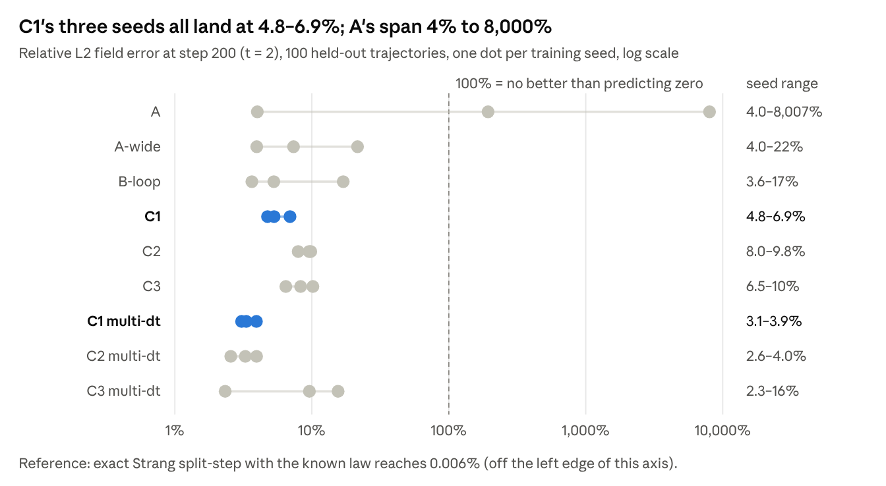
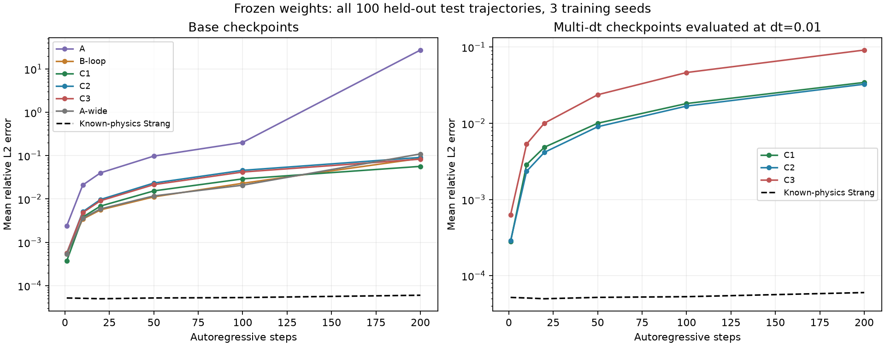
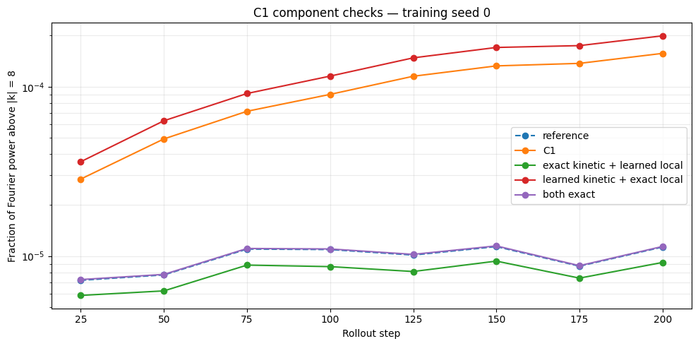

# SPNO / C1 — Paper Draft & Phase 6 Results

Oct 1, 2026 · @omer mazal

## Abstract (draft)

**Working title:** *What a structured operator learner identifies: localized failure in a learned split-step for the nonlinear Schrödinger equation.*

*Revised after the skeptical review. The first draft's framing, "matches a 550k-parameter FNO with 2.5k parameters", does not survive: baselines were unconverged, no size-matched FNO exists, and C1's typical rollout is worse.*

We learn one-step integrators for the 1D parametric cubic NLS. We compare an unconstrained Fourier Neural Operator (A) with a learned Strang splitting (C1). C1 has a kinetic rate κ(\|k\|²) and a pointwise local phase ν(ρ, V) in ρ = \|ψ\|², each a small MLP. By construction C1 conserves mass exactly and is reversible, symplectic and U(1)-equivariant. It has 2,466 parameters, against ~550k for the FNO.

In distribution, C1 reaches comparable one-step error (0.050% vs 0.054–0.059%) and never produced a catastrophic rollout (0 of 300). However, its median error after 200 steps is higher than the best FNO runs (3.7–5.7% vs 3.0–3.7%). Its advantage is in the tail, not the typical case.

The split structure lets us read out and swap the learned components. The learned dispersion matches −αk² exactly inside the excited band (slope 1.000) and saturates beyond it. Replacing only the kinetic component with the exact operator cuts phase-aligned error 14× in distribution and ~230× at 1.5–3× the training bandwidth. Replacing only the local component changes nothing. The pointwise nonlinear law transfers to unseen spectra and potential structure; every out-of-distribution failure is localized in the kinetic MLP and traced to the spectral support of the data.

We argue that the value of structure here is **identifiability and diagnosability**, not raw accuracy or parameter count. The open question is whether an extrapolating kinetic parameterization can identify the law beyond the data's support.

## Setup

All models learn the map ψ(t) → ψ(t+dt) for the periodic 1D NLS, conditioned on (V, α, β):

i\\\partial_t \psi = -\alpha\\\partial\_{xx}\psi \\-\\ \beta\\\|\psi\|^2\psi \\+\\ V(x)\\\psi, \qquad \omega(k) = \alpha k^2 - \beta A^2 + V_0

**Data:** N = 64 grid, dt = 0.01, 800 / 100 / 100 train / val / test trajectories of 200 steps. Initial bandwidth \|k\| ≤ 8, α ∈ \[0.7, 1.1\], β ∈ \[−0.4, 0.6\]. **Training:** one-step relative L2, AdamW, lr 1e-3, cosine schedule, 40-epoch cap, 3 seeds. C models use kinetic net K0 (free MLP) and local net L0.

| Model  | What it is                                           | Params (PyTorch) | Params (real) | Built-in invariants                |
|--------|------------------------------------------------------|------------------|---------------|------------------------------------|
| A      | Unconstrained FNO                                    | 287,746          | ~550k         | none                               |
| B-loop | A + hard mass projection, trained in the loop        | 287,746          | ~550k         | mass (by projection)               |
| C1     | Split-step: learned κ(\|k\|²) + pointwise phase in ρ | 2,466            | 2,466         | mass, symplectic, reversible, U(1) |
| C2     | Split-step, FNO phase in ρ                           | 288,770          | 550,914       | mass, reversible                   |
| C3     | Split-step, phase in Re/Im ψ (control)               | 288,834          | ~551k         | mass only                          |
| Strang | Exact split-step with the known law                  | —                | —             | reference, not a learner           |

PyTorch counts each complex spectral weight once. "Real" counts it twice and is the fair basis for the 223× ratio (117× on PyTorch counts). **Metrics:** one-step relative L2 on 20,000 test pairs; rollout relative L2 at step 200 (t = 2); relative mass and energy drift, all in float64.

## Phase 6 results

C1 never blows up, but on a typical trajectory it is not more accurate than a well-trained FNO. Out of distribution it wins where its pointwise structure matches the physics (potential shape), ties with every mass-conserving model under parameter extrapolation, and loses on spectral extrapolation.

frozen-test/summary.json · Phase 6 checkpoints bd4e108527-K0, 3 seeds, 100 test trajectories

The chart shows seed *means*, which the tails dominate. Per trajectory the picture flips:

| Step-200 error, 100 test trajectories per seed | C1               | B-loop           | A-wide           | A                |
|------------------------------------------------|------------------|------------------|------------------|------------------|
| Median (seeds 0 / 1 / 2)                       | 5.7 / 4.1 / 3.7% | 3.0 / 3.0 / 3.7% | 3.5 / 3.4 / 3.0% | 3.5 / 127 / 3.6% |
| Trajectories \> 10% (of 300)                   | 40               | 27               | 24               | 113              |
| Trajectories \> 100% (of 300)                  | **0**            | 5                | 5                | 84               |
| C1 wins, paired per trajectory                 | —                | 18 / 29 / 53%    | 26 / 34 / 42%    | 21 / 100 / 53%   |

C1 loses the typical-trajectory comparison in 6 of 9 seed pairings with the FNO family. A's seed 1 is a failed training run (early-stopped at epoch 13 with 9× worse validation loss), not evidence about FNOs. A mild CN penalty (λ = 0.01, Phase 7) also removes A's blow-ups at step 100. A likely reason C1 has the best one-step error but a worse rollout: its errors are systematic (a kinetic misfit, β_eff ≈ 0.9β), so they add up coherently from step to step.

*Mean relative L2 over all 100 test trajectories and 3 seeds (frozen-test/rollout-test.png).* C1 has the lowest base-model error at step 200 (5.7%); B-loop and A-wide lead slightly up to step 100. A's seed mean is ~5× worse from step 1 and blows up after step 100. With multi-dt training, C1 and C2 track each other to ~3% at step 200.

### Stress tests (G1–G4, G9)

Median across 3 seeds; rollout = relative L2 at step 200. Energy drift in brackets.

| Arm | Shift                                        | A                            | B-loop               | C1                        |
|-----|----------------------------------------------|------------------------------|----------------------|---------------------------|
| G1  | Fresh α inside \[0.7, 1.1\]                  | 358% (diverges in 2/3 seeds) | 9.3% \[4.7%\]        | **5.3%** \[0.07%\]        |
| G2  | α ∈ {0.5, 1.3, 1.5}, β ∈ {−0.5, 0.8}         | 1.7×10¹⁰ (all seeds blow up) | 71% \[28%\]          | **66%** \[0.10%\]         |
| G3  | Short-correlation potential (ℓ = 0.3)        | 340%; one-step 0.25%         | 9.4%; one-step 0.17% | **4.8%; one-step 0.052%** |
| G3  | V = 0, cosine, well, 2× amplitude            | 21–192%                      | 4.3–9.5%             | **4.4–5.1%**              |
| G4  | IC bandwidth \|k\| ≤ 12 → 24                 | 10¹² (blow-up)               | 110–126%             | 60–103%                   |
| G9  | Energy cascading above \|k\| = 8 at step 200 | 3.0× truth                   | 1.2× truth           | **14× truth**             |

- **G2 — graceful, not accurate.** The hard constraint is what prevents blow-up: B-loop is bounded too. C1 adds ~290× lower energy drift than B-loop.

- **G3 — the cleanest structural win.** V enters C1 pointwise, so its one-step error does not move when V gets rough; FNO one-step errors grow 3–4×.

- **G4 — everyone fails.** One-step errors reach 12–92% for all models. Bounded ≠ correct.

- **G9 — C1's weak spot.** C1 and C2 inject too much energy into high modes; B-loop and A-wide track the true cascade.

### Why C1 fails above the band (G5b + direct rate readout)

C1 recovers the kinetic rate −αk² to within 0.1% up to k = 8, then saturates near −80. The truth is −230 at k = 16 and −922 at k = 32; multi-dt does not change this. K0 is a tanh MLP, so \|κ(x) − κ(y)\| ≤ 2‖w_out‖₁ ≈ 102–107 for these weights. Test data carries only 2.5×10⁻⁸ of its energy above \|k\| = 15. Every model, A and A-wide included, shows ~100% error in the α-derivative of the phase at k ≥ 16.

**Component swap isolates the cause.** Replacing one C1 component at a time with the exact operator shows which part drives the G9 cascade error. Exact kinetic + learned local tracks the reference (0.8×). Learned kinetic + exact local overshoots 17.6× (seed 0; 16–21× across seeds), worse than full C1 (12–17×). The learned local phase is fine; the saturated kinetic rate is the whole problem.

*Fraction of Fourier power above \|k\| = 8, α = 0.9, β = 0.3, V = 0, 8 probe fields (learned_kinetic+exact_local.ipynb).*

## Findings

The defensible headline: **the split structure makes C1's learned operator decomposable, and the decomposition shows exactly what transfers and what does not.**

1.  **Main result: failure is localized.** Exact κ + learned ν cuts phase-aligned error 14× in distribution, 36× under α extrapolation and ~230× at bandwidth 12–24. Learned κ + exact ν reproduces C1 exactly (ratio 1.00), and bootstrap intervals exclude 1 in every case. The pointwise local law transfers; the kinetic MLP is the only thing that fails.

2.  **The dispersion law is identified within support only.** Slope 1.000, intercept ≈ 0, max error ≤ 1.1% for k ≤ 8 on all 6 checkpoints; flat at −80 beyond k ≈ 10. This has two causes the current data cannot separate: no training energy above k ≈ 9, and a bounded tanh head (2‖w_out‖₁ ≈ 103).

3.  **Locality buys a real OOD win.** With a rough potential (G3, ℓ = 0.3), C1's one-step error is unchanged (+1%) while FNO one-step errors grow 3–4×, A-wide included.

4.  **Reliability, not accuracy.** 0 of 300 catastrophic rollouts vs 5–84 for the FNO family, but C1's median rollout is worse than the good FNO runs. One-step error is comparable (0.050% vs 0.054–0.059%) at a budget where the FNOs had not converged.

5.  **Invariants as designed.** Mass sits at the Strang floor (4.8×10⁻¹⁴) and energy drift is 0.06%. C2, which is not symplectic, matches it, so reversibility plus the split is enough; symplecticity is not the differentiator.

6.  **Clear negatives.** G4 spectral extrapolation fails, with A-wide the better one-step predictor from bandwidth 16 on. G9 cascade energy is 14× too high. G5b finds no α-sensitivity above k ≈ 16 for any model.

**Related (Phase 7, PINO):** a CN residual at λ = 0.01 gives A healthy rollouts on all seeds (2.5% at step 100) but leaves 1.3% mass drift. On C1 it changes nothing. FNO blow-ups are partly an optimization pathology that a cheap penalty removes.

### Claims to avoid

- "C1 matches or beats the FNO with 223× fewer parameters." No size-matched FNO exists, the baselines were unconverged, and the typical rollout is worse.

- "C1 learns the dispersion relation" or "generalizes to unseen frequencies." It does so within the band only.

- "Structure gives graceful parameter extrapolation." B-loop does the same; it is mass conservation.

- "Symplecticity bounds energy." C2 is a counterexample.

- "Multi-dt improves C1 by 39%." That gain comes with 3× the updates; at matched updates multi-dt is worse.

## Caveats before submission

- **No size- or compute-matched FNO.** This is the biggest confound. Doubling A to A-wide (1.07M) improves validation error only ~6%, so a 2.5–50k FNO may come close to C1.

- **Budget-bound training.** 29 of 36 checkpoints hit the 40-epoch cap; the FNOs were still improving 14–25% over the last 5 epochs and C1 ≤ 1%. Every Phase 6 report is exploratory.

- **Report per seed and per trajectory.** Report medians, tail counts and paired comparisons, not the 2,735% mean that one failed A seed produces.

- **Data support and hypothesis class coincide** in the kinetic failure. The knee cannot be attributed to either until the bandwidth ladder (notebook 13) is run.

- **The component swap uses an oracle** (the exact κ). It diagnoses where error lives; it is not a deployable model.

- **Gauge.** κ(0) ≈ −25 is absorbed by the local net, so readouts and swaps need gauge fixing; C1g (κ(0) = 0) is not trained yet.

- **Novelty.** Learned split-step Fourier for the NLS already exists in fiber optics ([Häger & Pfister 2018](https://arxiv.org/pdf/1804.02799)), as do symplectic networks ([SympNets](https://arxiv.org/abs/2001.03750)) and [symplectic neural operators](https://arxiv.org/abs/2605.15881). The contribution must be the identifiability and decomposition analysis.

- **Untested:** resolution transfer, sample efficiency, misspecification (Phases 8–9 notebooks have no outputs), and inference speed.

- **Statistics:** 3 seeds, one data split, one shared test set; claim nothing under ~20% between non-failing models.

- **Strang wins by ~3 orders of magnitude** when the law is known. Motivate C1 by unknown or partially known dynamics, not speed.

## Next steps for the paper

- [ ] **Gate — size- and compute-matched Pareto:** C1 at width 8/16/32/64 vs FNO and FNO + projection at ~2.5k / 9k / 50k / 550k real parameters. Equal updates, per-model lr from {3e-4, 1e-3, 3e-3}, no early stopping, 5 seeds. Primary metrics: median and p95 step-200 error and catastrophic rate on IID and G3-short. Optional axis: n_train ∈ {50, 200, 800}.

- [ ] **Main — kinetic identifiability:** training bandwidth {8, 12, 16} × kinetic head {K0 tanh, polynomial in k² with MLP coefficients, K1}, gauge-fixed, 3 seeds. Does the knee track the data, and does an extrapolating head recover −αk² to k = 32 from bandwidth-8 data?

- [ ] Train C1g (κ(0) = 0) and rerun the component swaps without post-hoc gauge correction

- [ ] **Boundary — Phase 9 misspecification:** nonlocal σ and gain/loss γ sweeps; find the crossover where the FNO overtakes C1; compare against the floor \|1 − e^{−γt}\|

- [ ] Rerun A seed 1 with longer patience; report A+PDE at step 200

- [ ] Time inference for C1 vs A (current numbers are MAC estimates, ~18–35×)

- [ ] Figures: component-swap bar chart (headline), kinetic readout, per-trajectory error distribution, G3 robustness, G9 cascade

## Sources

Local files in the pin repo and Downloads: 06_phase6_evaluation.ipynb, Phase6_all.ipynb (G1–G9 summary JSON), learned_kinetic+exact_local.ipynb, 12_gauge_identifiable_c1.ipynb, spno/results/phase6-diagnosis-2026-09-22/ (frozen-test, frozen-probes, endpoint diagnostics), comparison.csv (Phase 7). Full critique: [C1 vs FNO — Skeptical Review of Phase 6](https://claude.ai/code/artifact/5ee3675f-afd5-4003-a562-27a0fc986c1b).
