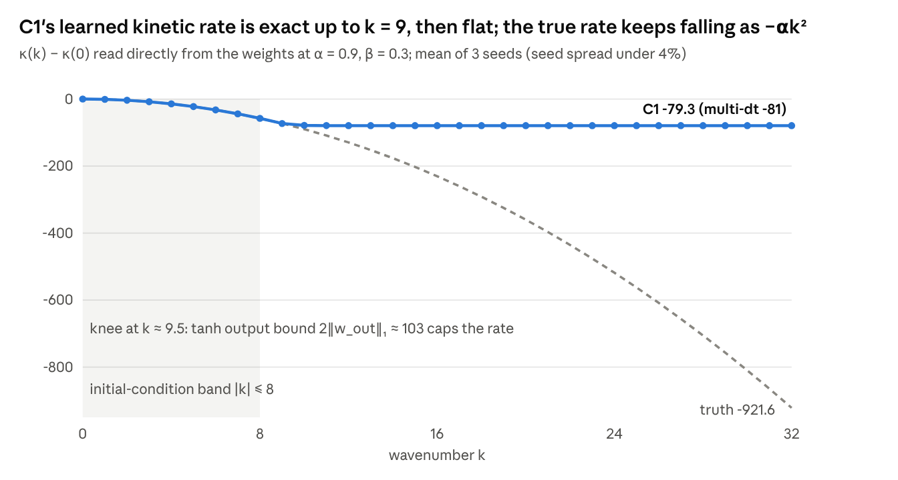

# C1 vs FNO — Skeptical Review of Phase 6

Oct 1, 2026 · @omer mazal

## A. Executive verdict

**There is a real result here, but it is not "C1 beats FNO".** C1 is a 2,466-parameter learned Strang splitting with exact mass conservation, reversibility, symplecticity and U(1) symmetry. In distribution it has the lowest one-step error of any learned model (0.050% vs 0.054–0.059%). That margin is 10–20% and was measured while every FNO was still improving 14–25% per 5 epochs.

On rollouts C1's *typical* trajectory is not better. Its median error at step 200 is 3.7–5.7%, against 3.0–3.7% for B-loop, A-wide and A's healthy seed. Paired per trajectory, C1 beats A seed 0 on only 21% of test trajectories. C1's mean advantage comes entirely from tails: 0 of 300 rollouts above 100% error, vs 84 for A, 5 for B-loop and 5 for A-wide.

Out of distribution, C1 is robust exactly where its pointwise structure matches the physics: rough potentials leave it unchanged while FNO one-step errors grow 3–4×. It is bounded but inaccurate under parameter extrapolation, as are B-loop, C2 and C3, so that is the mass constraint, not C1. Under genuine spectral extrapolation it fails, and from bandwidth 16 up its one-step error is worse than A-wide's.

The kinetic law C1 learns is quantitatively exact inside the excited band (slope 1.000, r = 1.000 for k ≤ 8) and collapses outside it (plateau at −80 vs −922 true at k = 32). It fits the data's spectral support; it does not learn a transferable dispersion law.

**The most interesting finding is one the experiment was not designed for.** Swapping in the exact kinetic operator cuts C1's phase-aligned error 14× in distribution and \~230× at bandwidth 16. All of C1's error lives in its 1,217-parameter kinetic MLP. Its learned local law transfers to unseen spectra because it is pointwise.

Missing controls (no parameter-matched FNO, budget-bound baselines, no sample-efficiency or resolution runs) keep this at **Level 2: a solid MSc research question.** It is one decisive experiment away from a defensible workshop claim.

## 1. Experimental design and C1's inductive bias

Every model learns one step ψₙ → ψₙ₊₁ of the periodic 1D NLS, iψₜ = −αψₓₓ − β|ψ|²ψ + Vψ, conditioned on (V, α, β). Phase 6 trains nothing new except the G6a and G7 cohorts; it evaluates 36 frozen checkpoints.

| Item | Value |
| --- | --- |
| Grid / domain | N = 64, length 2π, integer k, Nyquist 32 |
| Time step / horizon | dt = 0.01; trajectories of 200 steps (t = 2) |
| Reference solver | Strang split-step, 32 substeps per dt |
| Train / val / test | 800 / 100 / 100 trajectories = 160k / 20k / 20k pairs, one fixed split |
| Parameters | α ∈ \[0.7, 1.1\], β ∈ \[−0.4, 0.6\], V random field (amplitude 0–0.5, correlation length 1), mass 1–3 |
| Initial spectrum | \|k\| ≤ 8; energy above \|k\| = 15 in test data ≈ 2.5×10⁻⁸ of total |
| k\_wrap = √(π/αdt) | 16.9–21.2 over the training α range |
| Objective | One-step relative L2 (no rollout loss, no physics loss in Phase 6) |
| Optimizer | AdamW, lr 1e-3, wd 1e-4, batch 256, grad clip 1, cosine schedule |
| Stopping / selection | 40-epoch cap, patience 8, best-validation checkpoint; 29/36 hit the cap |
| Seeds | 3 (0, 1, 2), same data split for all |
| Precision | Train float32; invariants and rollouts evaluated in float64 on CPU |

| Model | Architecture | Params (real scalars) | What is hard-wired |
| --- | --- | --- | --- |
| A | FNO, 4 layers, width 64, 16 modes | 549,890 | nothing; modes \|k\| > 15 are not mixed |
| A-wide | Same, 32 modes (to Nyquist) | 1,074,178 | removes A's mode-truncation confound; not capacity-matched |
| B-loop | A + output rescaled to input mass, trained in the loop | 549,890 | mass only, by projection |
| C1 | Strang split: kinetic MLP κ(k², α, β) + pointwise local MLP ν(ρ, V, α, β) | 2,466 (1,217 kinetic + 1,249 local) | mass, reversibility, symplecticity, U(1) — exact for any weights |
| C2 | Split with FNO local phase reading (ρ, V, α, β) | 550,914 | mass, reversibility, U(1); not symplectic |
| C3 | Split with FNO local phase reading (Re ψ, Im ψ, …) | 550,978 | mass only; reversibility second-order (control) |

All parameters are trainable; only grids, k² and input-range buffers are fixed. PyTorch counts each complex spectral weight once, which gives A 287,746; real scalars are the fair unit.

### What C1 represents easily

- Any isotropic linear dispersion that is a smooth function of k² within the range it was trained on, applied exactly diagonally in Fourier space.
- Any gauge-invariant local nonlinearity that depends on ψ only through ρ = |ψ|² and V at the same point, applied as an exact phase rotation.
- Time-step changes: dt multiplies learned *rates*, so a C model can be run at an untrained dt. The FNO ignores dt entirely.
- Norm-preserving, time-reversible, symplectic dynamics, with no training needed for those properties.

### What C1 cannot represent, but an FNO can

- Nonlocal nonlinearities (convolution kernels in ρ), derivative or phase-gradient couplings (|ψ|²ψₓ), anisotropic or x-dependent dispersion.
- Any non-norm-preserving dynamics: gain/loss, damping, forcing. Its error is bounded below by the norm change.
- A correction for splitting error beyond what the two rates can absorb; the split structure caps how much of the Strang commutator it can learn away.
- Practically, though not in principle: a dispersion law outside the k² range the tanh MLP saw. Its output is bounded, |κ(x) − κ(y)| ≤ 2‖w\_out‖₁ ≈ 102–107.

### Terminology check

"Structure-preserving" is justified: the four invariants are theorems about the architecture and hold at random initialization. "Physics-informed" is not: Phase 6 uses no physics loss, and K0/L0 learn both rates from data. The accurate phrase is **a learned Strang splitting of an NLS-class Hamiltonian**: hard splitting structure plus a parameterization bias (diagonal in k², pointwise in ρ). It is not explicit conservation of the true energy.

## 2. Fairness audit

**No comparison in Phase 6 isolates "structure" from "size".** The design has a capacity-matched structured model (C2) and a truncation control (A-wide), but no parameter-matched FNO near 2.5k parameters and no converged baseline.

| Comparison | What differs besides the variable of interest | Grade |
| --- | --- | --- |
| B-loop vs A | Only the mass projection. Same core, data, optimizer and budget; both similarly budget-bound (last-5-epoch gain 14–25%) | **FAIR** |
| A-wide vs A | Modes 16 → 32 and 2× parameters. Answers "is A's high-k failure just truncation?", nothing more | **FAIR** for that question |
| C2 vs A | Same backbone and parameter count; differ in output-as-phase, the kinetic MLP and the split. C2 had nearly plateaued (3–5% last-5 gain), A had not (18–25%) | INFORMATIVE BUT CONFOUNDED (convergence) |
| C1 vs A | 223× fewer parameters, different architecture, different convergence state (C1 ≤ 1% last-5 gain vs A 18–25%), A seed 1 a failed run (early-stopped at epoch 13, 9× worse validation loss) | INFORMATIVE BUT CONFOUNDED |
| C1 vs B-loop | Same as above minus mass; isolates "everything C1 has beyond mass" only if capacity and convergence were equal — they are not | INFORMATIVE BUT CONFOUNDED |
| C1 vs C2 | Locality, symplecticity and a 223× capacity gap all change together | INFORMATIVE BUT CONFOUNDED |
| C3 vs B-loop | Both mass-only, but via different architectures | INFORMATIVE BUT CONFOUNDED |
| C1 vs parameter-matched FNO (\~2.5k) | Does not exist | **NOT AVAILABLE** — the central missing control |
| Multi-dt (G6a) vs base | 3× the gradient updates (75k vs 25k). At matched updates (first 13 epochs) multi-dt C1 is 20–49% *worse* than base | INFORMATIVE BUT CONFOUNDED (compute) |
| G7 fixed-α vs varying-α | Different training sets; A's varying cohort includes the failed seed, which dominates its band means | NOT INTERPRETABLE for A; weak for C1 |
| G6b dt transfer | FNO cannot be evaluated (ignores dt) | No comparison; descriptive for C-family |
| Phase 7: A+PDE vs C1 | Same protocol; objective differs by a CN residual (λ = 0.01) | INFORMATIVE: shows what a mild regularizer does for A |

### Budget and compute

| Model | Wall-clock per seed | Last-5-epoch val. improvement | Val. one-step (seed mean) |
| --- | --- | --- | --- |
| A | 0.75–0.90 h (seed 1: 0.25 h, early stop) | 18–25% | 6.3×10⁻⁴ (healthy seeds) |
| A-wide | 1.07–1.34 h | 21–24% | 5.9×10⁻⁴ |
| B-loop | 0.76–0.84 h | 14–23% | 5.9×10⁻⁴ |
| C2 | 0.81–0.97 h | 3–5% | 6.0×10⁻⁴ |
| C1 | 0.10–0.12 h | 0.7–1.0% | **5.2×10⁻⁴** |

Wall-clock is `time.time()` on one Windows machine, not controlled compute. Validation-to-train loss ratios are 1.07 (C1) to 1.13 (A-wide): nobody overfits, so the gaps are about optimization state and bias, not memorization.

**Implication.** The FNOs' late gains partly reflect the cosine schedule annealing to zero, so the trend cannot simply be extrapolated. But a 14–25% drop over the last 5 epochs means they had not reached their floor; a longer schedule closing even half of that gap would put B-loop and A-wide at C1's 5.2×10⁻⁴. **The current evidence is insufficient to establish that C1 has lower *converged* one-step error than the FNOs.**

## 3. Phase 6 arm by arm

All numbers: 3 seeds, 100 trajectories per arm, rollout = relative L2 at step 200. "Diverged" means a seed-mean rollout error above 100%. G4 and G5 are covered in section 4.

| Arm | Shift actually applied | C1 one-step | Best FNO-family one-step | C1 rollout (per seed) | Baselines' rollout | Claim strength |
| --- | --- | --- | --- | --- | --- | --- |
| Frozen test | None (IID) | 0.050% | B-loop 0.054%, A-wide 0.054% | 6.9 / 5.3 / 4.8% | B-loop 3.6 / 5.3 / 17%; A 4.0 / 193 / 8007% | Suggestive (one-step); see §6 for typical-trajectory reversal |
| G1 | Fresh draw, same ranges — a second IID test set | 0.052% | B-loop 0.058% | 7.0 / 5.3 / 4.8% | B-loop 5.0 / 9.3 / 23%; A 5.3 / 358 / 15,650% | Suggestive |
| G2 | α ∈ \[0.5, 1.5\], β ∈ \[−0.5, 0.8\] | 0.84% | A-wide 0.67%, B-loop 0.87% | 69 / 66 / 66% | B-loop 65 / 71 / 83%; C2 66–74%; A 10⁶–10¹⁰ | **Negative** for C1-specific benefit |
| G3 short (ℓ = 0.3) | Same V amplitudes, finer spatial structure | 0.052% (+1% vs IID) | C2 0.081%; B-loop and A-wide 0.17% (3× IID) | 6.2 / 4.8 / 4.4% | B-loop 4.5 / 9.4 / 21%; A-wide 9.8 / 7.9 / 7.3%; A 5.5 / 340 / 5346% | **Strong** |
| G3 strong (2× V) | V amplitude outside training range | 0.054% (+5%) | B-loop 0.062% | 5.1% median | B-loop 9.5%; A 192% | Suggestive |
| G3 zero / cosine / well | Different V families, in-range amplitudes | 0.048–0.054% | B-loop 0.054–0.059% | 4.4–4.8% medians | B-loop 4.3–5.4%; A-wide 5.8–9.9% | Weak (small gaps) |
| G6a | Trained on dt ∈ {0.005, 0.01, 0.02}, tested at each | 0.021 / 0.041 / 0.080% | C2: 0.019 / 0.036 / 0.067% | 3.1 / 3.9 / 3.3% at dt = 0.01 | C2 3.3 / 4.0 / 2.6% | Inconclusive (compute-confounded) |
| G6b | Base C models run at untrained dt = 0.005, 0.02 | ω residual ≲ 2×10⁻² for k ≤ 8 at every dt | FNO: cannot be run | — | — | Suggestive, but only an architectural capability |
| G7 | Retrain with α fixed at 0.9 | High-band error 72 → 65 (band-relative) | A: 87 → 7.8 | — | — | Inconclusive |
| G9 | Energy cascade into \|k\| > 8, step 200 | 14× truth | B-loop 1.24×, A-wide 0.75×, A 3.0× | — | C2 12×, C3 3.5× | **Negative** for C1 |

### Reading each arm

- **G1 (interpolation).** It asks whether all models do fine in range. They do on one-step: C1 is lowest at every α in the scatter, by about 10%. A's rollout mean is destroyed by seeds 1 and 2, which are training failures, not interpolation failures. *Alternative:* convergence state (§2). Suggestive only.
- **G2 (parameter extrapolation).** The plan predicted that "A degrades sharply; the C family degrades gracefully". The rollout pattern matches, but the cause is mass conservation: B-loop, C2 and C3 sit in the same 65–83% band. One-step, C1 is no better than the FNOs outside the α range; everyone reaches 3–5% at α = 1.4. C1's one real G2 edge is energy drift (0.10% vs 28% for B-loop). The component swap (§4) puts the failure in the kinetic net's α-extrapolation. **Bounded at 66% error is not graceful in any useful sense.**
- **G3 short (combination generalization).** This is the cleanest structural result. Pointwise values of V are in range, but their spatial arrangement is new. C1's ν(ρ, V) is pointwise, so it is indifferent to how V is arranged; any FNO must map V through learned global filters fitted to smooth V. A-wide degrades as much as A, so this is not mode truncation. C2's FNO local phase degrades 25%, between C1 and the FNOs. *Alternative:* none plausible; consistent across 3 seeds with a 3× gap.
- **G6a / G6b (time step).** One-step error scales almost linearly with dt (0.021 → 0.041 → 0.080%), as it should for a constant learned rate error. G6b shows the base models' rates transfer to untrained dt inside the excited band and fail identically above it. That is a capability the FNO lacks by construction, so there is nothing to compare it against. The multi-dt rollout gain (C1 5.7% → 3.4%) cannot be credited to multi-dt itself (§2).
- **G7 (α-conditioning).** It was meant to isolate cause (b) of high-k failure: α-dependence routed through the lift. Fixing α cuts A's high-band error 11× but barely moves C1's. That fits "C1's high-k failure is not about α" (it is saturation). A's cohort is contaminated by the failed seed, so the A side is not interpretable.
- **G9 (cascade).** C1 puts 14× too much energy into modes above 8 (12–17× across seeds); C2 does the same. B-loop and A-wide track the truth. The component swap shows learned κ + exact ν overshoots 16–21×, while exact κ + learned ν tracks the truth (0.8×). The cascade error is entirely the saturated kinetic rate: modes above k ≈ 10 rotate at the wrong frequency, so energy stops dephasing out of them. **This is C1's clearest physical-fidelity failure.**

## 4. Spectral and kinetic generalization

**C1 learns the dispersion law exactly where the data put energy and nowhere else.** That is identification within support, not a transferable law.

### Which tests are which kind of generalization

| Test | Kind | Why |
| --- | --- | --- |
| G1 | Interpolation | Same distribution, new seed |
| G3 short | Combination generalization | V values seen; their spatial frequency is new; field band unchanged |
| G3 strong | Amplitude extrapolation (in V) | V values up to 2× the training maximum |
| G2 | Parameter extrapolation | α, β outside the box; also moves k\_wrap to 14.5–25.1 |
| G4 | **Spectral extrapolation** | IC energy at \|k\| 9–24, where training carried \~10⁻⁵ (k 9–15) to \~10⁻⁸ (k > 15) of the energy |
| G5a / G5b | Plane-wave probe | OOD input class; k ≤ 8 is in-band, k ≥ 16 is spectral extrapolation |
| G6b | Time-step transfer | Same physics, untrained dt |
| Resolution transfer | **NOT TESTED** | Phase 8 notebook has no outputs |

No test in Phase 6 is a resolution-transfer test, and none should be reported as one.

### The learned kinetic law, quantitatively

| Fit of κ(k) − κ(0) against −αk² (6 checkpoints) | k ≤ 8 | k ≤ 32 |
| --- | --- | --- |
| Slope | 0.9996–1.0003 | 0.059–0.063 |
| Intercept | −0.001 to 0.007 | −44 to −45 |
| Correlation r | 1.0000 | 0.61 |
| Max relative residual | 0.1–1.1% | 91% |
| Error at k = 10 / 12 | 10–13% / 37–39% | — |
| Plateau value | — | −78.8 to −81.8 (truth −922 at k = 32) |

Inside the band the law is quantitatively right: correct slope, no offset, no compression. The break is sharp at k = 9 → 10, it is identical across seeds and across base vs multi-dt, and it sits where training energy vanishes. Two causes coincide, and Phase 6 cannot separate them:

1. **Data support.** One-step loss is blind to κ where modes carry \~10⁻⁵ of the energy.
2. **Hypothesis class.** A tanh MLP has bounded output (here ≤ \~103 apart), so with these weights it cannot represent −αk² beyond k ≈ 10.7 at α = 0.9. Larger weights widen the range, but any finite tanh MLP stays bounded while k² does not.

Notebook 13 (kinetic support ladder) is built to separate them and has not been run.

### G5a / G5b — identifiability via the α-derivative

G5a is a theorem check: at fixed α, the one-step map pins ω only modulo 2π/dt above k\_wrap, for every model. The probe reproduces this on the reference to 3×10⁻¹⁵. G5b asks whether the ∂(phase)/∂α = −k²dt signal, which is free of wrapping, is extracted. The hypothesis was that C1/C2 extract it and A does not.

| Relative error of ∂ arg m / ∂α | k = 8 (seed range) | k = 16 | k = 32 |
| --- | --- | --- | --- |
| C1 | 4.9% (2.9–8.0) | 97% | 99% |
| C1 multi-dt | **1.4%** (1.3–1.4) | 98% | 99% |
| C2 | 7.9% | 91% | 98% |
| C3 | 2.9% | 88% | 97% |
| B-loop | 3.2% | 97% | 99% |
| A | 7.3% (2.2–15) | 97% | 99% |
| A-wide | 3.6% | 95% | 99% |

**Null result, and the plan says to report it either way.** Above the band, no model carries any α-sensitivity (about 100% error means a derivative of about zero). A-wide fails as A does, so truncation is not the explanation. The failure starts at k = 16, below k\_wrap, so it is not aliasing either. In band, base C1 is no better than B-loop, C3 or A-wide; only multi-dt C1 stands out (1.4%), and that is compute-confounded.

### G4 — genuine spectral extrapolation

| One-step error | bw 12 | bw 16 | bw 20 | bw 24 |
| --- | --- | --- | --- | --- |
| C1 | **12%** | 43% | 74% | 92% |
| A | 14% | 31% | 53% | 63% |
| A-wide | 15% | **28%** | **41%** | **51%** |
| B-loop | 18% | 35% | 56% | 66% |

Rollouts: every FNO blows up (10⁸–10¹⁹); C1 and C2 sit at 60–104%, where 100% equals predicting zero. **C1 has no skill here; it is just bounded.** From bandwidth 16 on, the unrestricted A-wide is the better one-step predictor. That is negative evidence for Story C.

### Component swap — where the failure lives

Notebooks 11–12 replace one learned half of frozen C1 with the exact operator. They fix the gauge (κ(0) ≈ −25 to −28 is carried by the local net) and compare phase-aligned final-state error, with paired bootstrap ratios over 5 probe batches × 3 seeds.

| Case | Exact κ + learned ν, vs C1 (aligned error) | Learned κ + exact ν, vs C1 |
| --- | --- | --- |
| G1 (IID) | 0.072 \[0.054, 0.096\] — 14× better | 1.00 |
| G2 α-only | 0.028 — 36× better | 1.00 |
| G2 β-only | 0.083 — 12× better | 1.00 |
| G3 short | 0.071 | 1.00 |
| G4 bw 12 / 16 / 24 | 0.0043 / 0.0042 / 0.0045 — \~230× better | 1.00 |

With the exact kinetic step, the *learned* local law reaches 0.4–0.6% aligned error at bandwidths 12–24, against C1's 66–88% at bandwidths 12–16. The local net transfers to unseen spectral content because it never sees k: it is pointwise in ρ. Its fitted law after gauge fixing is ν ≈ 0.94–0.96·βρ − 0.98·V, plus a spurious α-term (−0.21 to −0.33) and 14–19% residual RMSE. The rollout drift probe puts the effective nonlinearity at about 0.88β.

**Answer to the deeper question:** C1 learns a transferable *local* law and a support-limited *kinetic* fit. Pointwise locality is what transfers; the k²-MLP is what does not. The FNO offers no handle for this decomposition at all.

## 5. Parameter efficiency, optimization vs representation

**C1 is smaller; whether it is more parameter-efficient is unknown.** Phase 6 has one point per family, so there is no Pareto curve.

| Model | Real params | Compression vs C1 | Val. one-step | Test one-step | Est. MACs per step | Wall-clock train / seed |
| --- | --- | --- | --- | --- | --- | --- |
| C1 | 2,466 | 1× | 5.2×10⁻⁴ | 0.050% | \~0.15M (\~0.08M with κ cached per α, β) + 4 FFTs of 64 | 0.10–0.12 h |
| A | 549,890 | 223× | 6.3×10⁻⁴ (healthy seeds) | 0.056–0.059% | \~2.7M + 8 FFTs of 64 × 64 channels | 0.75–0.90 h |
| B-loop | 549,890 | 223× | 5.9×10⁻⁴ | 0.054% | \~2.7M | 0.76–0.84 h |
| A-wide | 1,074,178 | 436× | 5.9×10⁻⁴ | 0.054% | \~3.7M | 1.07–1.34 h |
| C2 | 550,914 | 223× | 6.0×10⁻⁴ | 0.062% | \~2.8M | 0.81–0.97 h |

MACs are my count from the architectures, not measured runtimes. Inference speed was never benchmarked, so no speed claim is supported.

### Why the 223× headline is fragile

- **FNO error is flat in parameters at this scale.** Doubling A to A-wide (550k → 1.07M) improves validation error by only \~6% (6.3 → 5.9×10⁻⁴). If the FNO curve is that flat, a 10–50k FNO might land near 6×10⁻⁴ too. The real compression ratio could then be 4–20×, not 223×.
- **The Strang floor is far away.** Every learned model is 8–10× worse than one Strang step (6.2×10⁻⁵). Nobody is near the representational limit; this is an optimization-limited regime.
- **C1's own error budget is all kinetic.** With the exact κ, aligned rollout error drops 14× (§4). The 1,217-parameter kinetic MLP is the bottleneck; the 1,249-parameter local MLP is close to sufficient.

### Optimization or representation?

| Signal | C1 | FNO family | Reading |
| --- | --- | --- | --- |
| Last-5-epoch val. gain | 0.7–1.0% | 14–25% | C1 has converged; FNOs have not |
| Val / online-train ratio | 1.07 | 1.10–1.13 | No overfitting anywhere |
| Seed CV of val. loss | 6.6% | 2.5% (B-loop) to 127% (A) | A has an optimization-failure mode (seed 1) |
| Train time to plateau | \~0.1 h | not reached in \~1 h | C1 trains fast |
| Training curves for train loss | online only | online only | Final train loss not logged separately |

This is the "easy optimization" case, not the "stronger bias after convergence" case. C1 reaches a lower floor *faster*; the FNOs had not reached theirs. Neither model overfits, and C1 shows no regularization signature such as higher train error with better test error. **The current evidence is insufficient to establish that C1's in-distribution advantage is representational.** The OOD advantages in G3 (locality) and the absence of blow-ups are more plausibly representational, since no amount of FNO training removes the global V-filter or adds norm conservation.

A's seed 1 deserves its own line. It early-stopped at epoch 13 with 9× worse validation loss: patience 8 is too short for a noisy FNO validation curve. Reporting it as "A diverges" without saying it is a training failure would be misleading.

## 6. Physical fidelity and statistical robustness

**C1 trades a heavier body for a missing tail.** On a typical trajectory it is less accurate than the good FNO runs; it simply never blows up. This is the finding the mean-based tables hide.

### Error distribution at step 200, IID test (100 trajectories per seed)

| Model | Median (per seed) | Mean (per seed) | Trajectories > 10% | Trajectories > 100% |
| --- | --- | --- | --- | --- |
| C1 | 5.7 / 4.1 / 3.7% | 6.9 / 5.3 / 4.8% | 40 / 300 | **0 / 300** |
| B-loop | 3.0 / 3.0 / 3.7% | 3.6 / 5.3 / 17% | 27 / 300 | 5 / 300 |
| A-wide | 3.5 / 3.4 / 3.0% | 22 / 4.0 / 7.4% | 24 / 300 | 5 / 300 |
| A | 3.5 / 127 / 3.6% | 4.0 / 193 / 8007% | 113 / 300 | 84 / 300 (77 from seed 1) |
| C1 multi-dt | 2.6 / 3.2 / 2.8% | 3.1 / 3.9 / 3.3% | 3 / 300 | 0 / 300 |
| C2 multi-dt | 2.8 / 3.3 / 2.1% | 3.3 / 4.0 / 2.6% | 0 / 300 | 0 / 300 |

### Paired, same-seed, per-trajectory comparison

| Pair | Fraction of trajectories where C1 wins (seed 0 / 1 / 2) | Median ratio C1 / other |
| --- | --- | --- |
| C1 vs A | 21% / 100% / 53% | 1.66 / 0.04 / 0.93 |
| C1 vs B-loop | 18% / 29% / 53% | 2.04 / 1.35 / 0.90 |
| C1 vs A-wide | 26% / 34% / 42% | 1.46 / 1.33 / 1.28 |
| C1 multi-dt vs C2 multi-dt | 53% / 58% / 23% | 0.94 / 0.97 / 1.30 |

C1 loses the typical-trajectory comparison in 6 of 9 FNO pairings. Two of its three wins are against A's failing seeds (1 and 2). The ordering flips across seeds for B-loop and for C2 multi-dt, so neither difference exceeds seed variance. Density error tells the same story: C1 4.6–6.0% vs B-loop 2.7–4.0% on seeds 0–1.

**Unexpected phenomenon worth flagging.** C1 has the *best* one-step error and a *worse* typical rollout. The likely mechanism is coherent error accumulation: C1's error is systematic, a fixed kinetic misfit plus β\_eff ≈ 0.88–0.96β, so it adds up step after step, while FNO errors are less correlated across steps. One-step error therefore does not rank models for rollout, which is itself a reportable methodological point.

### Invariants and spectral behaviour (IID test, step 200)

| Quantity | C1 | C2 | B-loop | A (seed 0) | A-wide | Strang |
| --- | --- | --- | --- | --- | --- | --- |
| Mass drift | 4.8×10⁻¹⁴ | \~5×10⁻¹⁴ | 1.8×10⁻¹⁵ | 2.3% | 0.2–126% | 4.8×10⁻¹⁴ |
| Energy drift | 0.06–0.07% | 0.06–0.08% | 1.0–7.2% | 2.9% | 2.5–125% | 0.0007% |
| Cascade energy above \|k\| = 8 vs truth (G9) | 14× | 12× | 1.2× | 3.0× | 0.75× | 1× |
| Phase-aligned error (seed 0) | 5.6% | — | 2.7% | 3.2% | 3.4% (seed 1; seed 0: 20%) | — |

- **Mass:** exact for C1 at the Strang floor in float64. B-loop is lower only because it projects explicitly; that is not "more physical".
- **Energy:** C1 ≈ C2 even though C2 is not symplectic. That fits reversible-KAM (time-symmetric methods also bound energy), so **symplecticity cannot be credited for C1's energy behaviour**; reversibility plus the split is enough. The 54× gap to B-loop is real but belongs to the whole C family.
- **Spectral fidelity:** C1 has the worst cascade of all models. Good invariants plus wrong spectral energy transfer is the clearest case of "conserves the right quantities, gets the dynamics wrong".

### Statistical limits

There are three seeds, one data split, and one 100-trajectory test set shared by all models, with no confidence intervals at seed level. Per-trajectory paired comparisons are informative but correlated within a seed. Only notebook 12's component swaps carry bootstrap intervals (5 probe batches × 3 seeds), and those are descriptive and not multiplicity-adjusted. **Differences under \~20% between non-failing models should not be claimed.** The only effects that are large and consistent across seeds are the tail-failure counts, the G3-short gap, the kinetic knee, the cascade overshoot and the component-swap ratios.

## 7. Failure modes: where C1's bias breaks

The boundary of validity is sharp: **C1 generalizes along every axis its local MLP sees through ρ and V, and fails along every axis its kinetic MLP must extrapolate (k, α).**

| # | Failure | Evidence | Cause | Severity |
| --- | --- | --- | --- | --- |
| 1 | Kinetic saturation above k ≈ 9.5 | κ flat at −80; 13% wrong at k = 10, 39% at k = 12 | No training energy there, plus a bounded tanh head | High: drives 2, 3 and 4 |
| 2 | No spectral extrapolation | G4: one-step 43–92% at bw 16–24, worse than A-wide | Failure 1 | High for any Story C claim |
| 3 | Wrong nonlinear cascade | G9: 14× excess high-k energy; learned κ + exact ν gives 16–21× | Failure 1: high modes rotate too slowly and do not dephase | High for physical-fidelity claims |
| 4 | Weak α-extrapolation | G2 α-only: exact κ cuts aligned error 36× | Kinetic MLP takes α as a free input with no product structure | Medium |
| 5 | Worse typical rollout than good FNOs | Median 3.7–5.7% vs 3.0–3.7% | Coherent systematic error (§6) | Medium: undercuts the "as accurate" claim |
| 6 | Gauge non-identifiability | κ(0) ≈ −25 to −28, cancelled by the local intercept; raw component swaps give 95–155% error until gauge-fixed | (κ − c, ν + c) gives the same step | Low for accuracy, high for any "interpretable law" claim until C1g exists |
| 7 | Biased local law | β\_eff ≈ 0.88–0.96β, spurious α-term, 14–19% residual RMSE | L0 must discover the product βρ (documented 2.1% RMSE plateau) | Low to medium |
| 8 | Restricted model class | Cannot express nonlocal, derivative or non-Hamiltonian terms | Architecture | Unknown: Phase 9 (misspecification) not run |
| 9 | Single-PDE design | The split is the NLS integrator with learned rates | Design choice | High for novelty and generality |

Point 9 is the one a reviewer will press hardest. C1 is a split-step Fourier method whose two rates are MLPs. That is exactly the structure of *learned digital backpropagation* in fiber optics, which trains split-step Fourier steps for the NLS end to end ([Häger & Pfister 2018](https://arxiv.org/pdf/1804.02799); [Physics-Based Deep Learning for Fiber-Optic Communication Systems](https://research.chalmers.se/en/publication/521455)). It is also close to symplectic neural operators in general. Novelty must come from the identifiability analysis and the comparison to operator learners, not from the architecture.

**Counter-evidence to C1's reliability edge, from Phase 7.** A soft Crank–Nicolson residual at λ = 0.01 gives A healthy rollouts on all three seeds: 2.5% at step 100 vs C1's 2.9%, with 1.3% mass drift. A's blow-ups are therefore partly an optimization or regularization pathology that a cheap penalty removes; they are not an inevitable property of unrestricted FNOs. Step 200 has not been reported for A+PDE.

## 8. Which story survives, and at what level

| Story | Verdict | Basis |
| --- | --- | --- |
| A — Parameter-efficient surrogate | **Partly.** "Comparable one-step accuracy at 1/223 the size" holds; "more efficient" is unshown | One point per family; FNO error flat in parameters; baselines unconverged |
| B — Better OOD generalization | **Split.** Yes for potential structure (G3); shared with every mass-conserving model under parameter extrapolation (G2); no for spectral shift (G4) | §3–§4 |
| C — Spectral law learning | **No beyond support; yes within it.** Slope 1.000 in band, plateau outside; G5b null for everyone | §4 |
| D — Sample efficiency | **NOT TESTED** | Phase 8 data-size curve never run |
| E — Long-term physical fidelity | **Mixed.** Exact mass and bounded energy, zero blow-ups; but worse typical rollout and the worst cascade | §6 |
| F — Bias–flexibility tradeoff | **Supported in form.** Wins where the physics is pointwise in ρ and V; loses where a learned component must extrapolate; A-wide beats it at bw ≥ 16 | Misspecification (Phase 9) is untested, so the full tradeoff is not shown |
| G — No convincing advantage | **True for the headline "C1 beats FNO"** | §5–§6 |

**Compatible combination: F + partial A + a new story, H.** Story H is *modular identifiability*: the split decomposes the learned operator into components that can be read out, swapped and diagnosed independently. Doing so shows that the local law transfers and the kinetic law does not. No FNO allows this.

### Paper / thesis level: **Level 2**

| Criterion | Status |
| --- | --- |
| Novelty | Low for the architecture (learned split-step exists in fiber optics); moderate for the identifiability and decomposition analysis |
| Strength of evidence | Strong for invariants, G3, the kinetic knee and the component swaps; weak for accuracy and efficiency claims |
| Baseline quality | Weak: unconverged, no parameter-matched FNO, one A seed failed |
| Controls | Good internal ones (A-wide, C3, B-loop, swaps); missing size and compute controls |
| Reproducibility | Good: config hashes, checkpoint SHAs, frozen-weight replays to 2.6×10⁻¹⁰ |
| Mechanism | Clear and analytic (bounded tanh output, pointwise locality, gauge) |
| Importance | Moderate: what structure buys an operator learner, and when, is an open question people care about |

**What blocks Level 3:** a parameter- and compute-matched Pareto comparison with converged baselines, and evidence that the decomposition story generalizes, by fixing the kinetic extrapolation with an extrapolating basis or showing the knee tracks data support. **What blocks Level 4:** a second PDE (or Phase 9 misspecification) that tests the bias–flexibility boundary, and more seeds and splits.

### Strongest result, stated precisely

> Freezing a trained C1 and replacing only its kinetic half with the exact dispersion operator reduces phase-aligned rollout error 14× in distribution and 230× on initial conditions with 1.5–3× the training bandwidth. Replacing only the local half changes nothing (ratio 1.00). With 3 seeds × 5 probe batches, the bootstrap intervals exclude 1 in every case. The learned pointwise nonlinearity therefore transfers to unseen spectral content, and all spectral-shift failure is localized in a 1,217-parameter kinetic MLP whose output saturates where the training data stop.

**Strongest skeptical counterargument.** "You built the NLS integrator and let two MLPs learn its coefficients. Of course the local law transfers: it is a scalar function of ρ with the right inputs, and you handed the model the splitting. The 'swap' uses the exact dispersion, which is an oracle. The interesting question is whether C1 *learns* the kinetic law, and it does not, because a tanh MLP cannot extrapolate k² and your data have no high-k energy. That is an observation about your data and activation function, not about structure. Meanwhile an FNO with a 1% physics penalty matches your rollout reliability, and you never tried a small FNO."

The defensible reply is to concede the oracle and the NLS specificity, then show (a) whether an extrapolating kinetic parameterization recovers −αk² beyond support and (b) the size-matched Pareto comparison. Both are in section H.

## B. What Phase 6 establishes

1. C1's four structural properties (exact mass, exact reversibility, symplecticity, U(1) equivariance) hold on trained weights. Mass drift sits at the float64 Strang floor (4.8×10⁻¹⁴ at step 200).
2. In distribution, C1 reaches one-step error comparable to 550k–1.07M-parameter FNOs (0.050% vs 0.054–0.059%) with 2,466 parameters, at this 40-epoch budget.
3. C1 had zero catastrophic rollouts (> 100% error) in 300 IID trajectories, and no unbounded growth in any shift. The FNO family had 5–84 per 300 IID. Bounded is not accurate: at G4 bandwidth 24, C1's seed means reach 102–103%.
4. C1 is insensitive to the spatial structure of V (G3 short: +1% one-step error vs 3× for B-loop and A-wide). Pointwise locality is the evident mechanism.
5. Inside the excited band, C1's learned dispersion is quantitatively the true law: slope 1.000, intercept ≈ 0, max error ≤ 1.1% for k ≤ 8, on all 6 checkpoints.
6. Outside that band it saturates near −80 because of a bounded tanh head and missing training energy. No model, A-wide included, recovers α-sensitivity above k ≈ 16 (G5b null).
7. With the exact kinetic step, C1's learned local law transfers to 1.5–3× the training bandwidth with 0.4–0.6% aligned error. All spectral-shift and cascade failures are localized in the kinetic MLP.
8. C-family models transfer to an untrained dt inside the band (G6b), which the FNO cannot attempt.
9. Energy drift is bounded at \~0.06% for both C1 and C2, so reversibility plus the split suffices and symplecticity is not the differentiator.

## C. What Phase 6 does NOT establish

- **That C1 is more accurate than an FNO.** Its typical-trajectory rollout is worse in 6 of 9 seed pairings, and its one-step lead was measured against unconverged baselines. *The current evidence is insufficient to establish this claim.*
- **That C1 is more parameter-efficient.** There is no parameter-matched FNO and no Pareto curve, and FNO error barely moves between 550k and 1.07M.
- **That C1 learns a transferable dispersion law.** It learns the law on the support of the data only.
- **Spectral generalization of the full model.** G4 is a failure; the local-law transfer needs the oracle kinetic step.
- **Better parameter extrapolation from structure.** G2's bounded error is shared by every mass-conserving model, and one-step errors outside the α range match the FNOs'.
- **Resolution transfer** — not tested.
- **Sample efficiency** — not tested.
- **That multi-dt training helps.** The gain comes with 3× the updates; at matched updates multi-dt is worse.
- **That symplecticity matters for energy.** C2, which is not symplectic, matches it.
- **Speed.** Inference was never timed.
- **Any statistical significance.** Three seeds, one split, no intervals except the descriptive bootstraps in notebook 12.
- **That FNO blow-ups are intrinsic.** One A seed is a failed run, and a λ = 0.01 physics penalty removes the blow-ups at step 100.

## D. C1 vs FNO

| Property | C1 | FNO / A (and A-wide, B-loop where noted) | Evidence |
| --- | --- | --- | --- |
| In-distribution accuracy | One-step 0.050% (best); rollout median 3.7–5.7% | One-step 0.054–0.059%; rollout median 3.0–3.7% on healthy seeds | Comparable. C1 better one-step, worse typical rollout; baselines unconverged |
| Parameter efficiency | 2,466 params | 550k (A, B-loop), 1.07M (A-wide) | **UNKNOWN**: smaller, yes; no Pareto curve, no matched-size FNO |
| Parameter OOD (G2) | Bounded, 66%; one-step ≈ FNOs | A blows up (10⁶–10¹⁰); B-loop bounded at 65–83% | Advantage over A comes from mass conservation, shared with B-loop |
| Potential-structure OOD (G3 short) | One-step unchanged (+1%) | One-step 3–4× worse | **Strong C1 advantage** (locality) |
| Spectral OOD (G4) | 12% → 92% one-step, bw 12 → 24; bounded rollouts with no skill | A-wide better one-step from bw 16; FNO rollouts blow up | Neither works; FNO better one-step, C1 bounded |
| Dispersion fidelity | Exact for k ≤ 9 (slope 1.000); saturates at −80 | Not readable directly; G5b α-derivative ≈ 0 above k = 16, as for C1 | C1 is inspectable and correct in band; nobody is right out of band |
| Resolution transfer | **NOT TESTED** | **NOT TESTED** | Phase 8 not run |
| Sample efficiency | **NOT TESTED** | **NOT TESTED** | Phase 8 data-size curve not run |
| Long-rollout stability | 0 / 300 blow-ups; bounded in all shifts | A 84 / 300 (77 from a failed seed); B-loop and A-wide 5 / 300 each; A+PDE (λ = 0.01) stable to step 100 | C1 more reliable; the gap shrinks with a mild regularizer |
| Physical invariants | Mass to 5×10⁻¹⁴; energy 0.06%; cascade 14× too strong | A: mass 2.3%, energy 2.9% (best seed); B-loop: mass exact, energy 1–7%; cascade 1.2–3× | C1 wins on invariants, loses on spectral energy transfer |
| Time-step transfer | Works in band (G6b) | Not possible (no dt input) | Architectural capability, not a measured advantage |
| Interpretability / diagnosis | Components readable and swappable | None | Unique to the split structure |

## E. Most interesting finding

**The split structure makes the learned operator decomposable, and the decomposition shows exactly what transfers.** On frozen weights, using the exact kinetic step with C1's learned local law cuts phase-aligned error 14× in distribution, 36× under α extrapolation and \~230× at 1.5–3× the training bandwidth. Using the learned kinetic step with the exact local law reproduces C1's error exactly (ratio 1.00). The learned pointwise nonlinearity is spectrally agnostic and generalizes; the learned kinetic MLP fits the training support and saturates beyond it (slope 1.000 for k ≤ 8, flat at −80 above k ≈ 10).

This is more interesting than the original hypothesis ("C1 beats FNO above k\_wrap"), which came back null. It turns the identifiability question into a precise, testable claim: **a structured operator learner identifies exactly the components whose inputs the data excite, and its failures are localized.** An unrestricted FNO cannot be decomposed this way.

Second, smaller surprise: C1 has the best one-step error and a worse typical rollout. Systematic errors accumulate coherently in a structured model, so one-step validation loss is a poor proxy for rollout quality in this family.

## F. Biggest weakness / confound

**There is no parameter- and compute-matched, converged FNO baseline.** Every comparative claim (accuracy, efficiency, reliability) currently confounds structure with size (223×), convergence state (C1 plateaued; FNOs still improving 14–25% per 5 epochs) and training luck (A seed 1 early-stopped at epoch 13).

Two observations make this confound live rather than hypothetical:

- A-wide at 2× A's size is only 6% better, so FNO error may be nearly flat down to much smaller sizes.
- A λ = 0.01 physics penalty removes A's blow-ups, so FNO unreliability looks partly like an optimization artefact.

Until a small FNO (2.5k–50k parameters, with and without mass projection) is trained to convergence under the same budget, "structure" and "small and easy to optimize" cannot be told apart for any in-distribution or reliability claim.

The second confound is specific to Story C: in the kinetic failure, **data support and hypothesis class coincide.** The training data have no energy above k ≈ 9, and the tanh head cannot extrapolate k². Phase 6 cannot say which one causes the knee.

## G. Paper-worthy claim

### Conservative claim (defensible now)

> For the parametric 1D NLS, a learned Strang splitting with 2,466 parameters reaches one-step error comparable to 0.55–1.1M-parameter FNOs at a fixed 40-epoch budget. It conserves mass exactly, keeps energy drift near 0.06% over 200 steps and produced no catastrophic rollouts. Its pointwise nonlinear component generalizes to unseen potential structure and, given the exact dispersion operator, to unseen spectral bandwidth. Its learned dispersion is exact inside the excited band and saturates outside it. The model's out-of-distribution failures are therefore localized in the kinetic component and traceable to the spectral support of the training data.

### Stronger claim (after the experiments in H)

> At matched parameter count and training compute, structured split-step operators dominate FNOs on the reliability–size Pareto front and degrade less under shifts that the structure covers (potential, nonlinearity, time step). With a kinetic parameterization that can extrapolate in k², the learned dispersion law is identified beyond the training bandwidth to within X%, which no FNO of any size achieves.

The second sentence is only claimable if the extrapolating-basis experiment succeeds without handing the model the k² product, i.e. without becoming K2.

### Claims we should NOT make

- "C1 outperforms FNO with 223× fewer parameters." Its typical rollout is worse, and the baselines were unconverged and not size-matched.
- "C1 generalizes to unseen frequencies" or "learns the dispersion relation." G4 and G5b say no.
- "Structure gives graceful parameter extrapolation." B-loop does the same; it is mass conservation.
- "Symplecticity bounds the energy error." C2 is not symplectic and matches it.
- "Multi-dt training improves C1 by 39%." That gain comes with 3× the compute.
- Any speed-up claim; any resolution-transfer claim; any sample-efficiency claim.

## H. Decisive next experiments

### Experiment #1 — Size- and compute-matched Pareto (highest value)

**Hypothesis.** At equal parameter count and equal training compute, C1 has lower rollout tail risk and lower G3-short error than an FNO, with or without mass projection. **Null:** a small converged FNO (+ projection) matches C1, and the Phase 6 gap was size and optimization.

| Element | Specification |
| --- | --- |
| Models | C1 (K0/L0) at width 8 / 16 / 32 / 64 (\~0.2k / 0.7k / 2.5k / 9k params). FNO at roughly matched real sizes (\~2.5k: width 4, 8 modes, small projection head; \~9k; \~50k; 550k). Each FNO also with in-loop mass projection (B-loop) |
| Parameter matching | Real scalar counts within ±15% at 2.5k and 9k; report the full curve |
| Compute matching | Same number of gradient updates per run (e.g. 100 epochs × 625 updates), fixed cosine schedule, no early stopping, best-val selection; lr from {3e-4, 1e-3, 3e-3} chosen on validation *per model and size* |
| Convergence gate | Last 10% of epochs improve validation by < 1%, otherwise extend and log it |
| Training data | Unchanged (bd4e108527: bw 8, α ∈ \[0.7, 1.1\], 800 trajectories) |
| Test sets | IID test, G3-short, G2, G4 bw 12, G9 cascade probe |
| Seeds | 5 per configuration (data split fixed; add a second split for the 2.5k pair) |
| Primary metric | Error-vs-parameters front of **median and p95 step-200 rollout error** plus **catastrophic rate (> 100%)** on IID and G3-short |
| Secondary | One-step error, phase-aligned error, energy drift, cascade ratio, wall-clock and measured inference time |
| Optional axis | n\_train ∈ {50, 200, 800} at the 2.5k pair — the missing sample-efficiency test, at small extra cost |
| Cost estimate | \~20 C1 runs at \~0.15 h plus \~40 FNO runs at ≤ 1 h, about 1–2 GPU-days |

**If the structure hypothesis is right:** at 2.5k and 9k, FNO and FNO + projection are clearly worse than C1 on p95 error and G3-short; the C1 front lies below both at every matched size; only the 550k FNO approaches C1 in distribution.

**If it is wrong:** a converged \~2.5–9k FNO + projection matches C1's median and p95 within seed variance, and the catastrophic rate goes to zero with convergence. C1's remaining distinct advantages would then be G3 locality, invariants and interpretability, not accuracy or reliability.

### Experiment #2 — Kinetic identifiability: data support vs hypothesis class

**Hypothesis.** The κ knee is set by the training data's spectral support, and a kinetic parameterization that can extrapolate in k² (without being given the αk² product) identifies −αk² beyond that support. This is the only route to Story C.

- **Design:** training bandwidth {8, 12, 16} × kinetic head {K0 tanh MLP; a polynomial head κ = Σⱼ cⱼ(α, β)(k²/k²\_max)ʲ, j ≤ 3, with MLP coefficients; K1 as a reference}, all gauge-fixed (C1g), 3 seeds. Also A-wide trained at the same bandwidths. This extends notebook 13, which is ready but unrun.
- **Primary metric:** fitted slope and max relative error of κ(k) − κ(0) on k ≤ 32, and the knee position vs training bandwidth.
- **Secondary:** G4 one-step and rollout at bw 16–24; G5b α-derivative at k = 16, 24, 32; G9 cascade ratio.
- **If support-limited:** the K0 knee moves with bandwidth (≈ 9.5 → 13 → 17) and stays flat beyond it.
- **If the class is the limit and structure helps:** the polynomial head recovers slope ≈ 1 to k = 32 from bw-8 data, and G4 and G9 errors drop to the exact-κ hybrid level (≈ 0.5% aligned).
- **If neither:** the polynomial head also fails above support. Then Story C is dead, and the thesis should frame C1 as a reliable, interpretable surrogate rather than a law learner.

### Experiment #3 — Where the bias stops helping (misspecification)

This tests Story F, not size. Train C1 and size-matched FNOs on data from NLS plus (a) a nonlocal nonlinearity of width σ and (b) gain/loss γ, sweeping each dial separately. Measure the crossover where the FNO overtakes C1, and compare C1's error to its analytic floor |1 − e^{−γt}| for norm-preserving models. Phase 9 is already implemented but has not been run. It turns "structure wins" from a tautology into a measured boundary.

## I. Research direction

**Pursue spectral/kinetic identifiability, built on C1's decomposability. Run the parameter-efficiency control (Experiment #1) first, as a gate, not as the story.**

| Option | Verdict | Why, from the evidence |
| --- | --- | --- |
| Spectral / kinetic identifiability | **Primary** | The only finding that is both large and surprising: component swaps localize every OOD failure in the kinetic MLP, the in-band law is exact, and the knee is mechanistically explained. Experiment #2 decides whether it becomes a positive result or a clean negative one; both are thesis-worthy. |
| Parameter efficiency | **Gate** | Needed to make any accuracy claim honest; unlikely to be the headline, since FNO error looks flat in size and C1's typical rollout is worse. |
| Improve C1 | Secondary, inside #2 | The obvious fixes (gauge-fixed C1g, extrapolating kinetic head, L1 local features) are the experimental arms of #2. Do not tune C1 for leaderboard wins. |
| Generalization in general | Narrow it | Report G3 (locality) as the clean OOD win. Drop "graceful parameter extrapolation", which belongs to mass conservation. |
| Build out C2/C3 | Deprioritize | C2 adds 550k parameters for no OOD gain, matches C1 on energy and degrades on G3. C3 has done its job as a control. |
| Geometric / structure-preserving extensions | Later | Worth it only after #3 shows where the bias breaks; a second PDE (e.g. 2D NLS or Gross–Pitaevskii) is the Level-4 step. |
| Reconsider the architecture | No | The architecture behaves as designed; its limits are explained. The kinetic head, not the split, is what needs rethinking. |

**Framing for the advisor conversation.** Present it as "what does building in structure let you *identify*, and where do the identified pieces stop transferring?" Do not present it as "a tiny model that beats FNO". The first survives the skeptical review; the second does not.

## Sources

- Repo `pin/spno`: `models/split_learned.py`, `models/fno.py`, `scripts/run_phase6.py`, `data/shift.py`, `results/phase6-diagnosis-2026-09-22/` (frozen-test, frozen-probes, kinetic-rate-bounds, advanced-statistics, endpoint-diagnostics)
- Downloads: `Phase6_all.ipynb` (G1–G9 summary), `06_phase6_evaluation.ipynb`, `learned_kinetic+exact_local.ipynb`, `12_gauge_identifiable_c1.ipynb`, `comparison.csv` (Phase 7)
- Notebooks 08, 09 and 13 contain no outputs (not run)
- [Häger & Pfister, Deep Learning of the Nonlinear Schrödinger Equation in Fiber-Optic Communications (2018)](https://arxiv.org/pdf/1804.02799)
- [Physics-Based Deep Learning for Fiber-Optic Communication Systems](https://research.chalmers.se/en/publication/521455)
