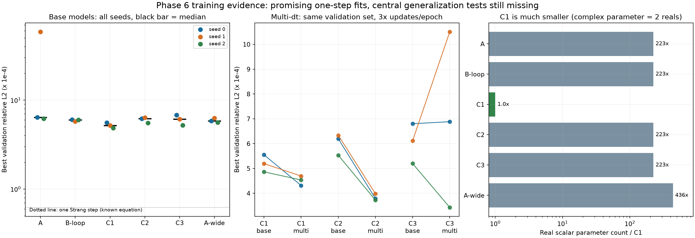

**Update, 22 September 2026:** Additional frozen-weight G5 and held-out test/rollout evaluations are now complete. [Updated research synthesis](research-synthesis-he.md). The status below describes the earlier audit stage.

**ניתוח מתקדם של Phase 6 — 22 בספטמבר 2026**

**שלב הלמידה הצליח והפיק מודלים שימושיים לחיזוי צעד אחד. התוצאות נותנות תמיכה ראשונית ביתרון של C1 ביעילות ובדיוק בתקציב הנוכחי. השאלה המחקרית המרכזית — הכללה ספקטרלית ופרמטרית של האופרטור — עדיין לא נבדקה בהרצה זו.**

מקור המספרים הוא סיכום האימון `phase6-training-bd4e108527-K0-standalone/metrics.json`, ובדיקות תקינות של כל 36 קובצי המשקולות. נוספו כאן רק שתי בדיקות ייחוס קצרות על הוולידציה: שדה ללא שינוי וצעד Strang יחיד. לא בוצע אימון חדש ולא הורצו ניסויי ההערכה החסרים G1–G9.

**מה נבדק בפועל**

המשימה היא חיזוי השדה המרוכב בצעד הזמן הבא במשוואת שרדינגר הלא־ליניארית, מתוך השדה הנוכחי, הפוטנציאל והפרמטרים. סט הבסיס כולל 800 מסלולי אימון, 100 מסלולי ולידציה ורשת בת 64 נקודות; כל מסלול מכיל 200 מעברים בזמן, בצעד dt=0.01. לפיכך יש 160,000 זוגות אימון ו־20,000 זוגות ולידציה. הזוגות מאותו מסלול תלויים זה בזה, ולכן אין להתייחס אליהם כ־20,000 מסלולים בלתי תלויים.

נשמרו 12 גרסאות מודל × 3 seeds. 31 ריצות הגיעו ל־40 אפוקים וחמש נעצרו מוקדם. 29 משקולות נחסמות בבדיקת ההתכנסות של הקוד, אף שהן תקינות וניתנות לטעינה. כל המספרים בהמשך הם תיאור של תוצאות בתקציב האימון הזה, ולא דירוג של מודלים שהתכנסו באופן מלא.

מדד הוולידציה הוא ממוצע השגיאה היחסית L2 לכל זוג שדות. בכל ריצה נלקח האפוק בעל שגיאת הוולידציה הנמוכה ביותר — אותו checkpoint שהאימון שומר. בחירת האפוק באמצעות הוולידציה מחייבת בדיקת test נפרדת לפני דיווח על ביצועים סופיים.

**השוואת מודלי הבסיס**

המספרים בטבלה הם ביחידות של 10⁻⁴; קטן יותר טוב יותר. לדוגמה, 5.20 פירושו 0.000520, שהם כ־0.052% שגיאה יחסית, ולא 99.948% דיוק בסיווג. סטיית התקן מתארת שונות בין שלושה seeds ואינה רווח סמך.

| מודל | seed 0 | seed 1 | seed 2 | ממוצע ± סטיית תקן |
|---|---:|---:|---:|---:|
| C1 | 5.55 | 5.20 | 4.86 | 5.20 ± 0.34 |
| A-wide | 5.85 | 6.27 | 5.59 | 5.91 ± 0.34 |
| B-loop | 6.03 | 5.76 | 5.99 | 5.93 ± 0.15 |
| C2 | 6.20 | 6.34 | 5.54 | 6.02 ± 0.43 |
| C3 | 6.80 | 6.12 | 5.20 | 6.04 ± 0.80 |
| A | 6.38 | 58.59 | 6.19 | 23.72 ± 30.20 |

C1 משיג את שגיאת הוולידציה הנמוכה ביותר מבין ששת מודלי הבסיס בכל אחד משלושת ה־seeds. הממוצע שלו נמוך בכ־12.2% מ־B-loop, בכ־11.9% מ־A-wide, ובכ־13.6% מ־C2. זהו דפוס עקבי במדגם הקטן הזה; שלושה seeds על אותו פיצול נתונים אינם מספיקים להכרזה על יתרון כללי או על מובהקות סטטיסטית.

C1 כולל רק 2,466 פרמטרים. לפי ספירת הפרמטרים בקוד, ל־A יש 287,746 — פי 117 בקירוב. הספירה הזאת סופרת מספר מרוכב כאיבר אחד: אם סופרים רכיבים ממשיים, ל־A יש 549,890 ול־C1 עדיין 2,466, פער של פי 223. המסקנה הנתמכת היא יעילות פרמטרית גבוהה של C1 בניסוי הזה. היא אינה מוכיחה שכל אילוץ פיזיקלי מועיל, או מבודדת איזה רכיב ב־C1 אחראי לשיפור.

הזמנים המתועדים של C1 בבסיס הם 6.2–7.3 דקות לריצה, לעומת כ־46–51 דקות ל־B-loop וכ־49–58 דקות ל־C2. אלה מדידות זמן שעון מאותה סדרת ריצות, ולא benchmark מבוקר של חומרה, עומס או זמן חישוב פעיל.

**למה לא נכון לומר ש־C1 טוב מ־A ב־78% באופן גורף**

פער הממוצעים אכן מגיע לכ־78%, אבל הוא נשלט על ידי A/seed1: ריצה שנעצרה אחרי 13 אפוקים, כאשר האפוק הטוב ביותר היה החמישי. בשני ה־seeds האחרים, שניהם רצו 40 אפוקים, C1 משפר את השגיאה בכ־12.9% ובכ־21.4%. צריך לשמור בדיווח גם את ה־seed החלש; אפשר להציג ניתוח רגישות, אך לא למחוק אותו או להציג את פער הממוצעים כיתרון ארכיטקטוני טהור.

B-loop מוריד את השגיאה לעומת A בכל שלושת ה־seeds, אך השיפור ב־seeds 0 ו־2 הוא כ־5.4% ו־3.2%, בעוד שהפער ב־seed1 גדול בגלל העצירה המוקדמת של A. B-loop גם מציג שונות קטנה: סטיית תקן יחסית של כ־2.5%. הדבר תואם אפשרות שההיטל מסייע ליציבות האימון, אבל אינו מוכיח את המנגנון ואינו מהווה מדידה של שימור מסה לאורך rollout.

A-wide משפר לעומת A בכ־8.2% ובכ־9.6% ב־seeds 0 ו־2; התוצאה מעניינת, אבל כמעט הכפלת מספר הפרמטרים והגדלת מספר המודים השתנו יחד. לכן לא ניתן לייחס את השיפור לביטול חיתוך תדרים בלבד. בפרט, הוולידציה כאן אינה בדיקת הכללה לתדרים גבוהים.

C2 ו־C3 כמעט זהים בממוצע בבסיס: 6.02 לעומת 6.04 ביחידות הטבלה. במדד הזה בלבד אין עדות ברורה לכך ש־C2 עדיף על C3. הבדיקות המבניות והבדיקות לטווח ארוך עשויות להפריד ביניהם, אך הן עדיין חסרות.

**G6a: התוצאה המבטיחה השנייה, עם גורם מתערב חשוב**

בדקתי שקובצי הוולידציה של הבסיס ושל G6a ב־dt=0.01 זהים בדיוק: השדות, הפוטנציאלים, alpha, beta ומזהי המסלולים. לפיכך השוואת שגיאות הוולידציה ביניהם נעשית על אותה מטרה.

| מודל | בסיס: ממוצע ×10⁻⁴ | G6a: ממוצע ×10⁻⁴ | שינוי בשגיאה הממוצעת |
|---|---:|---:|---:|
| C1 | 5.20 | 4.52 | ירידה של 13.2% |
| C2 | 6.02 | 3.83 | ירידה של 36.4% |
| C3 | 6.04 | 6.94 | עלייה של 14.9% |

השיפור של C2 חוזר בכל seed: כ־38.9%, 37.1% ו־32.7%. G6a/C2 הוא בעל הממוצע הנמוך ביותר מבין המודלים שנבדקו על סט הוולידציה המשתנה־ב־alpha, עם שונות יחסית של כ־3.5%. הוא גם טוב מ־G6a/C1 בכל שלושת ה־seeds.

אולם G6a מקבל 480,000 זוגות לאפוק, לעומת 160,000 בבסיס: 1,875 עדכוני optimizer לעומת 625. ארבעים אפוקים הם 75,000 עדכונים לעומת 25,000, ולכן זה אינו ניסוי בעל תקציב עדכונים שווה. בנוסף משתנים פיזור צעדי הזמן ואופק הזמן הכולל בכל מסלול. כרגע אפשר לומר שהמתכון המורחב עובד טוב יותר ל־C1 ול־C2; אי אפשר לומר שכבר בודדנו תועלת ייחודית של multi-dt או הוכחנו העברה לצעד זמן חדש.

בדיקת רגישות מתוך ההיסטוריות מחזקת את הצורך בבקרה: ב־13 האפוקים הראשונים של G6a/C2, שהם 24,375 עדכונים, שגיאת הוולידציה הטובה הממוצעת היא כ־0.00110. C2 הבסיסי מגיע לכ־0.000602 אחרי עד 25,000 עדכונים. זו אינה השוואה מבוקרת — לוח קצב הלמידה נמצא במיקום שונה ומספר הזדמנויות הבחירה בוולידציה שונה — אך אין כאן עדות ליתרון G6a בתקציב עדכונים דומה.

G6a/C3 מדגים את הסכנה בבחירת seed מוצלח: seed2 מגיע ל־3.43×10⁻⁴, הטוב ביותר בריצה בודדת מבין המודלים על הוולידציה הזאת, אבל שני ה־seeds האחרים מגיעים רק ל־6.88 ו־10.51×10⁻⁴. שניהם נעצרו מוקדם. לכן אין להציג את C3 כמנצח לפי ה־seed הטוב, וגם אין להסיק שהארכיטקטורה גרועה באופן עקרוני לפי הממוצע בלי לבדוק את מנגנון האימון.

**G7: מה אפשר ללמוד מה־alpha הקבוע**

על הוולידציה של alpha קבוע, A ו־C1 כמעט שווים: ממוצעי השגיאה הם 4.63 ו־4.66×10⁻⁴, פער של כ־0.7%. C2 אינו יציב: 17.03, 3.78 ו־9.54×10⁻⁴ בשלושת ה־seeds.

הדבר מראה שהיתרון שנראה ל־C1 בבסיס אינו חוזר כיתרון ברור בכל משימה. הוא תואם השערה שפרמטריזציה משתנה חשובה להשוואה, אך אינו מוכיח אותה: כאן משתנים גם הנתונים ורמת הקושי. ניסוי G7 המתוכנן צריך להעריך מודלים שאומנו עם alpha משתנה וקבוע על אותו סט test קבוע, ולמדוד בנפרד שגיאות בתדרים נמוכים וגבוהים ואת היחס ביניהן. מספר הוולידציה הכולל אינו מחליף את ההשוואה הזאת.

**כמה משמעותית השגיאה הנמוכה? בדיקות ייחוס חדשות**

חישבתי על כל 20,000 זוגות הוולידציה של הבסיס, מתוך 100 מסלולים:

| שיטה | שגיאת L2 יחסית ממוצעת | מקור |
|---|---:|---|
| השדה נשאר ללא שינוי | 0.228598 — כ־22.86% | חישוב חדש |
| C1 בסיס | 0.000520 — כ־0.0520% | ממוצע שלושת ה־checkpoints שנבחרו בוולידציה |
| G6a/C2 | 0.000383 — כ־0.0383% | ממוצע שלושת ה־checkpoints שנבחרו בוולידציה |
| צעד Strang יחיד עם המשוואה הידועה | 0.00006219 — כ־0.006219% | חישוב חדש |

שגיאת C1 קטנה בערך פי 439 משגיאת השארת השדה ללא שינוי. זה מחזק מאוד את המסקנה שהמודל למד התפתחות בזמן משמעותית, ולא רק מנצל את העובדה שמדובר בצעד זמן קטן.

מנגד, שגיאת C1 גדולה בערך פי 8.4 משגיאת צעד Strang אחד, ושגיאת G6a/C2 גדולה בערך פי 6.2. לכן עדיין אין בסיס לטענה שהמודלים הגיעו לדיוק הייחוס הפיזיקלי הזה. Strang משתמש במשוואה הידועה ואינו מודל לומד; הוא מספק קנה מידה פיזיקלי, לא הוכחה שכל משימת למידה צריכה לנצח אותו. שגיאתו גם אינה חסם תחתון תאורטי לשגיאה של מודל נלמד.

הבדיקה חושבה ב־complex64 וב־complex128; התוצאות כמעט זהות. אלה שגיאות צעד אחד על נתוני ולידציה. אין להסיק מהן שגיאה מצטברת ל־200 צעדים, שימור אנרגיה או שחזור נכון של ספקטרום.

**אופטימיזציה, עצירה מוקדמת ו־overfitting**

קצב הלמידה יורד באמצעות cosine schedule לאורך 40 אפוקים, בעוד שעצירה מוקדמת מתרחשת לאחר שמונה אפוקים ללא שיפור. חמש הריצות שנעצרו מוקדם הסתיימו אחרי 13–21 אפוקים. הן לא הגיעו לחלק האחרון, בעל קצב הלמידה הנמוך, שבו כמה מהריצות האחרות משתפרות באופן עקבי. זהו הסבר אפשרי לשונות, שדורש בדיקה מבוקרת ולא שינוי שרירותי של סימוני convergence.

C1 הבסיסי משתפר רק בכ־0.7–1.0% בחמשת המעברים האחרונים בין אפוקים; A ב־seeds 0 ו־2 משתפר בכ־17.8% ו־22.5%, ו־A-wide בכ־20.9–24.3%. הדבר מצביע על רמות שונות של התייצבות תחת אותו תקציב. יתרון C1 אחרי 40 אפוקים הוא יתרון מדוד בתקציב הזה, אך אינו מבטיח שיהיה הגדול ביותר לאחר אימון ארוך יותר.

ברוב ריצות הבסיס שהגיעו ל־40 אפוקים, שגיאת הוולידציה האחרונה גבוהה בכ־6.6–12.7% מממוצע שגיאת האימון באפוק האחרון. הפער אינו מציג כשלעצמו סימן ברור ל־overfitting חמור. עם זאת, שגיאת האימון נמדדת תוך שינוי המשקולות במהלך האפוק, והוולידציה בסופו, ולכן זו בדיקת אינדיקציה ולא הערכה זהה של אותו checkpoint על שני הסטים. ב־G6a פיזור צעדי הזמן באימון שונה מזה בוולידציה, ולכן יחס train/val אינו מדד נקי ל־generalization gap.

**מטרת המחקר ומה עדיין לא הוכח**

| שאלה | מצב הראיות הנוכחי |
|---|---|
| האם המודלים למדו חיזוי צעד אחד בהתפלגות האימון? | כן: ירידת שגיאה בוולידציה ויתרון גדול על שדה ללא שינוי |
| האם C1 יעיל בתקציב ובמשימה הזאת? | תמיכה עקבית בשלושה seeds: שגיאה נמוכה ומודל קטן מאוד |
| האם הרחבת האימון ל־multi-dt עזרה ל־C2? | כן במתכון שנמדד; עדיין לא בודדנו את השפעת multi-dt מתוספת עדכונים |
| האם האופרטור מכליל ל־alpha/beta, פוטנציאלים ותדרים חדשים? | לא נבדק: G1–G4 לא רצו |
| האם המודל למד את יחס הדיספרסיה ואת התלות ב־alpha? | לא נבדק: G5a/G5b, לב Phase 6, לא רצו |
| האם יש העברה לצעדי זמן אחרים? | לא הוכח בוולידציה הנוכחית, המחושבת רק ב־dt=0.01 |
| האם נשמרת דינמיקה טובה לאורך זמן והעברת אנרגיה בין תדרים? | לא נבדק: rollout והערכת G9 חסרים |
| האם המבנה הפיזיקלי הוא סיבת היתרון? | עדיין לא הוכח: חסרות הערכות ואבלציות מבוקרות |

הריצה הזאת היא K0 בלבד. גם השוואת K0/K1/K2, שנועדה להבחין בין למידה של התלות הפיזיקלית לבין אספקתה מראש במבנה, אינה כלולה בנתונים האלה.

**מה כדאי לבדוק לפני הוצאה נוספת על אימון**

1. להעריך את ה־checkpoints הקיימים כבדיקה אבחונית, עם תיוג מפורש של התקציב ומצב ההתכנסות. קודם test מצעד אחד ו־rollout, ואז G5b ויתר בדיקות Phase 6. הערכה כזאת יכולה לבדוק אם הפערים בוולידציה נשמרים ואם מטרת המחקר נתמכת בכלל.
2. להפריד את שאלת ההתכנסות ממנגנון הפלת ההרצה, ולא לשנות ידנית `converged=False` ל־True כדי לייצר תוצאה שנראית סופית.
3. לבדוק באופן ממוקד את השילוב של patience וקצב הלמידה בריצות שנעצרו מוקדם. לפני שמאריכים את כל 36 הריצות, לאפשר התחלה מהמשקולות הקיימות ושמירת optimizer/scheduler/RNG לריצות הבאות.
4. אם רוצים לטעון ליתרון של multi-dt כשלעצמו, להוסיף השוואה בתקציב עדכונים ולוח למידה תואמים. אפשר להתחיל בבקרה ממוקדת ולא לחזור על כל המטריצה.

נתוני החישוב המפורטים זמינים בקובץ `advanced-statistics.json` לצד הדוח. קוד הפרויקט, קובצי המשקולות וסימוני ההתכנסות לא שונו במסגרת הניתוח.
