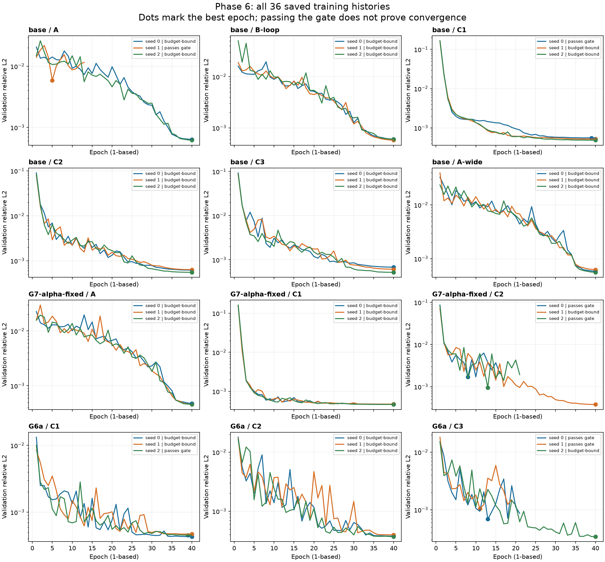

**Update, 22 September 2026:** Additional frozen-weight G5 and held-out test/rollout evaluations are now complete. [Updated research synthesis](research-synthesis-he.md). The status below describes the earlier audit stage.

# Phase 6 training diagnosis — 22 September 2026

**All 36 planned training jobs completed and were saved. The subsequent evaluation stopped before any experiment arm ran.**

Source: `C:\Users\omerm\PycharmProjects\pin\spno\results\phase6-training-bd4e108527-K0-standalone\metrics.json`. Training summary saved 21 September 2026 at 21:50 local time.

## Verified completion and integrity

- 12 model variants × 3 seeds: 36 histories and 36 checkpoint files; no missing training jobs.
- All 36 checkpoints deserialize safely, contain finite weights, match their histories and expected data hashes, and load into the recorded architectures with strict parameter checking.
- All 26 expected dataset shards load and have the expected trajectory shapes and configuration hashes. This audit did not scan every dataset value.
- The saved checkpoint content is metadata plus model weights. Optimizer, scheduler, and RNG state are absent, so exact training continuation is unavailable in these artifacts.
- No final Phase 6 evaluation metrics or plots exist. The empty training `plots` directory is created by the generic save helper; it does not indicate that training failed.

## Confirmed failure mechanism

The reported traceback was reproduced by calling the checkpoint loader only, with no training or experiment evaluation.

1. `run_phase6.py:1275` saves the complete training summary.
2. `run_phase6.py:1276` starts loading trained models. A, seed 0 is first.
3. `checkpoints.py:60` rejects its `converged=False` metadata as budget-bound.
4. The wrapper reports `checkpoint is incompatible`; the underlying cause is the policy check, not a tensor/architecture mismatch.
5. `run_selected_arms` at line 1317 and final result saving at line 1330 are never reached in this run.

```text
checkpoint is incompatible: C:\Users\omerm\PycharmProjects\pin\spno\results\phase6-standalone-artifacts\checkpoints\phase6\bd4e108527-K0\A-seed0.pt
checkpoint is budget-bound; raise the training epoch budget
Recreate it with: python scripts/run_phase6.py --standalone --kinetic K0 --seeds 0 1 2 --epochs <larger-budget>
```

## Training status by variant

`B` = budget-bound / blocked by the evaluator. `P` = passes the current code check, not a proof of convergence.
Each cell gives status, epochs run, and the best validation relative-L2 loss. Values compare only within a shared dataset/task; these are not test or rollout scores.

| Variant | Seed 0 | Seed 1 | Seed 2 | Recorded elapsed hours |
|---|---|---|---|---:|
| base/A | B · 40 ep · 0.000637622 | P · 13 ep · 0.00585915 | B · 40 ep · 0.000618799 | 1.90 |
| base/B-loop | B · 40 ep · 0.000603159 | B · 40 ep · 0.000575616 | B · 40 ep · 0.000598798 | 2.41 |
| base/C1 | P · 40 ep · 0.000555247 | B · 40 ep · 0.000519558 | B · 40 ep · 0.000486469 | 0.34 |
| base/C2 | B · 40 ep · 0.000619681 | B · 40 ep · 0.000633628 | B · 40 ep · 0.000553655 | 2.63 |
| base/C3 | B · 40 ep · 0.000680346 | B · 40 ep · 0.000611879 | B · 40 ep · 0.000519937 | 2.70 |
| base/A-wide | B · 40 ep · 0.000585127 | B · 40 ep · 0.000627428 | B · 40 ep · 0.000559416 | 3.57 |
| G7-alpha-fixed/A | B · 40 ep · 0.000475587 | B · 40 ep · 0.00045603 | B · 40 ep · 0.000457141 | 2.47 |
| G7-alpha-fixed/C1 | B · 40 ep · 0.000463553 | B · 40 ep · 0.000471926 | B · 40 ep · 0.000463432 | 0.35 |
| G7-alpha-fixed/C2 | P · 16 ep · 0.00170319 | B · 40 ep · 0.000378432 | P · 21 ep · 0.000954339 | 1.63 |
| G6a/C1 | B · 40 ep · 0.000431534 | B · 40 ep · 0.000469626 | P · 40 ep · 0.000453643 | 1.01 |
| G6a/C2 | B · 40 ep · 0.000378907 | B · 40 ep · 0.000398478 | B · 40 ep · 0.000372535 | 59.58 |
| G6a/C3 | P · 21 ep · 0.000688377 | P · 19 ep · 0.00105091 | B · 40 ep · 0.000342974 | 5.81 |

29/36 checkpoints are blocked; 7/36 pass the current check. 31 jobs ran all 40 epochs; five early-stopped at 13, 16, 19, 21, and 21 epochs.

The code defines convergence as `best_epoch < len(val_loss) - 1` (`experiments.py:190`). It checks whether the best epoch preceded the last epoch, not whether training reached a stable optimum. Two of the seven passing jobs (base C1/seed0 and G6a C1/seed2) ran all 40 epochs and pass only because their best loss occurred at epoch index 38. Five others early-stopped after eight epochs without a new best.

## What the curves show

- This run still used a 40-epoch cap. It did not train each model longer merely because the complete collection took several days.
- A/seed0 improved validation loss by 17.8% over the last five epoch transitions (index 34 to 39); A/seed2 by 22.5%. A-wide improved by 20.9–24.3% across its seeds. These histories support the finding that some models remain budget-limited.
- A/seed1 passes the gate but early-stopped after 13 epochs, with best loss 0.005859 versus about 0.00062–0.00064 for the other A seeds. Its best validation error is approximately 9.3× their mean. A passing flag therefore does not imply a better-trained model.
- G7/C2 and G6a/C3 also have early-stopped seeds with materially worse validation losses than their 40-epoch counterparts. Investigate early stopping and the training schedule before interpreting seed averages.



## Where the elapsed time went

The histories record **84.39 hours** in total. G6a/C2 alone accounts for **59.58 hours (70.6%)**, split as 26.28, 7.12, and 26.18 hours for seeds 0–2, each running 40 epochs.

These durations come from `time.time()` differences, not CPU/GPU-active timers. They can include suspension, inactivity, or resource contention; the files cannot establish why the two 26-hour intervals were so long. Multi-dt training uses three timestep datasets, but that fact alone does not explain the large variation between C2 seeds.

## What remains and how to avoid repeating the work

- Missing work is evaluation (default arms G1, G2, G3, G4, G5a, G5b, G6a, G6b, G7, G9), final metrics, and plots—not initial training coverage. The training summary does not record the original selected-arm CLI arguments.
- Preserve all current weights and histories. Do not rerun the same standalone command: it reuses datasets but retrains models from scratch and overwrites the checkpoints.
- A recovery change should first provide evaluation directly from this standalone artifact root, with any evaluation of budget-bound weights explicitly labelled diagnostic rather than converged results. This would reuse existing training to reveal further evaluation issues.
- If further training is required, add selective warm-start from saved weights and persistent optimizer/scheduler/RNG state for future exact resumption. Warm-starting these existing files would start a new optimizer/schedule; it is not an exact resume.
- Check the convergence/early-stop policy and recorded timing anomalies before committing to another large training budget. Increasing the cap alone does not guarantee every job passes the current check.

No project source, results, convergence flags, or checkpoints were modified. No training or full experiment evaluation was launched.
