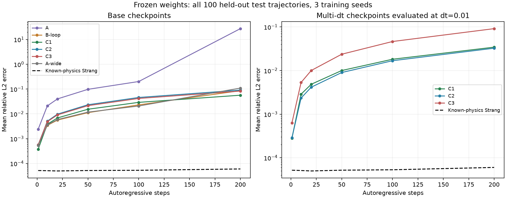
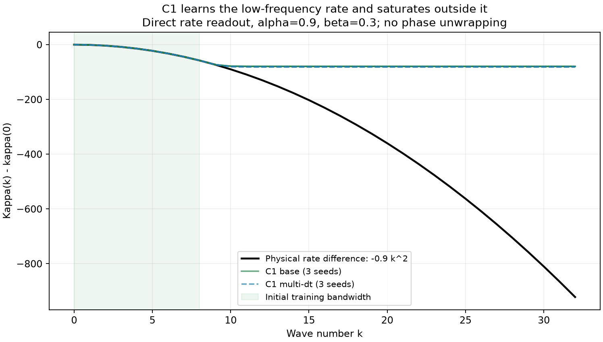

**Phase 6 — סיכום מחקרי מעודכן, בדיקות חדשות ותוכנית המשך | 22.09.2026**

כל 36 עבודות האימון של הריצה הסתיימו ונשמרו. ההרצה המקורית נעצרה לאחר האימון, לפני ניסויי ההערכה, בגלל כלל תוכנה שדוחה checkpoint שהאפוק הטוב ביותר שלו הוא האחרון. הקבצים תקינים. הניתוח המעודכן כבר כולל הרצת G5a/G5b ו־test/rollout על המשקולות השמורות, ללא אימון נוסף. לכן מסמך זה מעדכן את הדוח הקודם, שהתבסס בעיקר על ולידציה.

התמונה המחקרית מעורבת ומעניינת: C1 קטן מאוד, מדויק בתחום הנתונים ושומר מסה; יש לו התנהגות אנרגיה טובה והיעדר הכשלים הקיצוניים שנצפו בחלק מריצות FNO. אולם C1/K0 אינו משחזר את חוק הדיספרסיה בתדרים גבוהים. בדיקה ישירה של הקצב הנלמד מגלה רוויה, גם במודלי multi-dt. יתרון מבני ודיוק בתוך ההתפלגות אינם הוכחה לזיהוי המשוואה מחוץ לה.

**1. מה רץ, מה נשמר ומה נשאר**

| חלק | מודלים | seeds | checkpoints | מצב |
|---|---|---|---:|---|
| בסיס | A, B-loop, C1, C2, C3 | 0, 1, 2 | 15 | אומנו ונשמרו |
| הרחבת מספר מודים | A-wide | 0, 1, 2 | 3 | אומנו ונשמרו |
| G6a: אימון במספר צעדי זמן | C1, C2, C3 | 0, 1, 2 | 9 | אומנו ונשמרו |
| G7: אימון עם α=0.9 קבוע | A, C1, C2 | 0, 1, 2 | 9 | אומנו ונשמרו |
| סך הכול | 12 גרסאות × 3 seeds | | **36/36** | כל הקבצים נטענו ונבדקו |

נמצאו גם כל 26 קובצי הנתונים הצפויים. הנתונים העיקריים כוללים 800 מסלולי אימון, 100 ולידציה ו־100 test, רשת של 64 נקודות ו־200 מעברים למסלול, בצעד זמן 0.01. רוחב הסרט ההתחלתי הוא k≤8; תחומי האימון הם α∈[0.7,1.1], β∈[−0.4,0.6]. האימון משתמש בחיזוי צעד אחד, AdamW, קצב למידה התחלתי 0.001, דעיכת משקל 0.0001, batch=256, clipping=1, cosine schedule ו־patience=8. גרסאות C משתמשות ב־K0; C1 משתמש ב־L0. K1/K2 וגרסאות אימון rollout אינן כלולות בריצה הזאת.

31 ריצות הגיעו ל־40 אפוקים; חמש נעצרו מוקדם. 29 checkpoints מסומנים budget-bound ו־7 עוברים את הכלל של הקוד. אלה אינם 29 קבצים פגומים ואינם 29 אימונים שלא התחילו. כל קובץ כולל משקולות ומטא־דאטה; נבדקו ערכים סופיים, התאמה לארכיטקטורה, seed, hash הנתונים ואפוק הבחירה.

ב־G6a כל אפוק עובר על dt∈{0.005,0.01,0.02}: 480,000 זוגות ו־1,875 עדכונים, לעומת 160,000 זוגות ו־625 עדכונים בבסיס. ב־40 אפוקים מדובר בכ־75,000 לעומת 25,000 עדכונים. אין כאן תקציב אופטימיזציה שווה.

סכום זמני השעון המדווחים באימונים הוא כ־84.4 שעות. כ־59.6 שעות, 70.6%, נרשמו עבור שלוש ריצות G6a/C2. הזמנים אינם מדידה מבוקרת של חישוב פעיל ויכולים לכלול השהיות ועומס. C1 הבסיסי נרשם כ־6–7 דקות לריצה. אין הצדקה להפעיל שוב את כל 36 הריצות רק כדי להשלים הערכה.

| בדיקה | בהרצה המקורית | לאחר האנליזה הנוכחית |
|---|---|---|
| הכנת נתונים ואימון | הושלמו | נבדקו הקבצים |
| שערי תקינות של מכשיר המדידה | עברו לפני האימון | הורצו מחדש ועברו |
| G5a/G5b: דיספרסיה ותלות ב־α | לא הגיעו אליהם | הורצו עבור 18 מודלי בסיס ו־9 מודלי G6a |
| test רגיל + rollout ל־200 צעדים | אין תוצאה מהריצה שנפלה | הושלמו כעת ל־27 המודלים, על כל 100 מסלולי test |
| G1/G2: פרמטרים בתוך ומחוץ לטווח | לא רצו | נותרו |
| G3: פוטנציאלים שונים | לא רץ | נותר |
| G4: רוחבי סרט 12/16/20/24 | לא רץ | נותר |
| G6a: סריקת הערכה של צעדי הזמן | האימון הסתיים; ההערכה לא | נותרה; בדיקת dt=0.01 החדשה אינה מחליפה אותה |
| G6b: העברה בצעד זמן | לא רץ | נותר |
| G7: השוואה על test משותף ותדרים | האימון הסתיים; ההערכה לא | נותרה |
| G9: cascade ספקטרלי | לא רץ | נותר |
| חבילת המדדים והגרפים הרשמית של Phase 6 | לא נכתבה | עדיין אינה מלאה; התוצאות החדשות נשמרו בנפרד |

השמות G7/G9 בטבלה הם זרועות בתוך Phase 6, לא Phase 7/Phase 9 של הפרויקט. ההרצה הזאת גם אינה הוכחה שכל עשרת שלבי הפרויקט בוצעו.

**2. מה בדיוק קרה ואיך ממשיכים**

אחרי שמירת סיכום האימון, run_phase6.py מנסה לטעון את המודל הראשון, A/seed0. restore_checkpoint דוחה אותו מפני ש־converged=False. הכלל מחושב בפועל כ־best_epoch < len(val_loss)−1. הוא אינו מבחן התכנסות סטטיסטי או מבחן על גרדיאנטים. הודעת ה־wrapper מכנה זאת incompatible, למרות שהסיבה שנמצאה היא מדיניות קבלה ולא חוסר התאמה של המשקולות.

המשך **הערכה** אפשרי מיד: לשחזר את הארכיטקטורה מהמטא־דאטה, לבדוק hash ושמות, לטעון state_dict בקפדנות, ולהריץ את יתר המדידות במצב frozen-budget. זה בדיוק מה שבוצע כאן. אין צורך להעביר את converged ל־True או לשנות אף checkpoint. התוצאות חייבות לציין שהן מתארות את תקציב האימון הנוכחי.

המשך **אימון** הוא שאלה שונה. הקבצים אינם מכילים optimizer, scheduler או RNG, וגם שומרים את המשקולות הטובות בוולידציה ולא בהכרח את מצב האפוק האחרון. אפשר לבצע warm start מהמשקולות, אבל אי אפשר לשחזר בדיוק את רצף האימון המקורי. אם נחליט על המשך כזה, יש לשמור אותו כניסוי חדש עם תיעוד נקודת ההתחלה, לוח הלמידה ותקציב העדכונים.

מסלול ההמשך המומלץ הוא להפריד את טעינת הארטיפקטים ממדיניות ההתכנסות וממצב quick, להעריך כל זרוע וכל seed בנפרד, ולשמור תוצאה מיד עם סיום היחידה. manifest צריך לכלול hash של checkpoint ונתונים, גרסת קוד, תצורה, precision והמדידות שהושלמו. כך כישלון בגרף האחרון אינו מחייב שוב אימון או חישוב של זרועות קודמות. יש לשמור best checkpoint וגם last checkpoint הכולל מצב אימון מלא באימונים עתידיים.

שלוש מלכודות בקוד הקיים: הרצת --standalone מפעילה שוב אימון; הסרת --standalone מפנה למשקולות של Phase 2–5 במקום לתיקייה הזאת; --quick משנה שמות, נתונים ו־seeds. גם load_models(...allow_budget_bound=True) לבדו אינו פתרון נקי, כי הוא משתמש באותו דגל לבניית מזהי quick. יש לתקן את הפרדת האפשרויות, לא להשתמש באחת המלכודות כקיצור דרך.

קישור Colab שנמסר נפתח למסך התחברות, ולכן תוכן המחברת לא נבדק. לא הורצו תאים ולא שונתה המחברת. לא נמצא קובץ ipynb בעותק המקומי שנבדק. ב־Colab יש לוודא שהקוד, כל תיקיית checkpoints, הנתונים וה־manifest נשמרים באחסון מתמשך ושכל המשך משתמש באותם hashes; עצם קיום המחברת אינו שומר את מצב האימון. שגיאות git שנמסרו מאוחרות לתקלה ואינן הסיבה להפסקת הניסוי.

**3. תוצאות test חדשות: מה באמת חוזה טוב**

הטבלה הבאה חושבה כעת מהמשקולות השמורות: 20,000 זוגות test לכל מודל, ו־rollout אוטורגרסיבי על אותם 100 מסלולים במשך 200 צעדים, t=2. המספרים הם ממוצעים על שלושת seeds האימון. שגיאת שדה היא relative L2, לא מדד accuracy בסיווג. חיזוי צעד אחד נמדד ב־float32 ו־rollout ב־float64/CPU עם אותן משקולות מורחבות, בהתאם למעריך שבפרויקט.

| מודל | שגיאת צעד אחד ב־test | שגיאת שדה אחרי 200 צעדים | drift יחסי של האנרגיה הפיזיקלית בסוף |
|---|---:|---:|---:|
| A | 0.24210% | 2,734.70% — ממוצע שנשלט בכשלים | לא שימושי כממוצע מרכזי |
| B-loop | 0.05410% | 8.628% | 3.4210% |
| C1 | **0.05003%** | **5.660%** | 0.06323% |
| C2 | 0.06166% | 9.104% | 0.06771% |
| C3 | 0.06242% | 8.305% | 0.27702% |
| A-wide | 0.05357% | 10.957% | 44.2365% |
| C1, multi-dt | 0.04140% | 3.443% | 0.06348% |
| C2, multi-dt | **0.03629%** | **3.260%** | **0.04025%** |
| C3, multi-dt | 0.06895% | 9.157% | 0.30201% |
| צעד Strang עם חוק פיזיקלי ידוע | 0.00552% | 0.00602% | 0.000655% |

המודלים המובְנים ו־B-loop שומרים מסה ברמת עיגול: C1 סביב 4.8×10⁻¹⁴ אחרי 200 צעדים, כמעט בדיוק רצפת Strang באותה אריתמטיקה; B-loop סביב 1.8×10⁻¹⁵. ערך קטן יותר של B-loop אינו הוכחה שהוא פיזיקלי יותר, משום שהוא מבצע היטל מפורש. השימור המספרי הזה לא מחליף מדידת שגיאת שדה או אנרגיה.

**הממוצע לבדו מסתיר את הממצא החשוב ביותר ב־A.** ב־seed2, שגיאת צעד אחד היא רק 0.0564%. אחרי 200 צעדים החציון בין המסלולים הוא עדיין כ־3.61%, אבל 7 מתוך 100 מסלולים עוברים 100% שגיאה, והמסלול הגרוע מגיע ל־relative L2≈7,152. כך הממוצע מגיע ל־80.07, שהם כ־8,007%. מדובר בערכים סופיים אך עצומים; בדיקת NaN בלבד לא מסמנת אותם כהתבדרות. ב־seed1 הכשל רחב: 77 מתוך 100 מסלולים עוברים 100% שגיאה. חשוב לדווח גם כשל רחב וגם סיכון בזנב, ולא למחוק seed חלש.

| גרסה | seed0: שגיאת rollout ממוצעת | seed1 | seed2 | מספר מסלולים עם שגיאה >100%, לפי seed |
|---|---:|---:|---:|---|
| B-loop | 3.65% | 5.28% | 16.95% | 0, 1, 4 |
| C1 | 6.93% | 5.30% | 4.75% | 0, 0, 0 |
| A-wide | 21.56% | 3.96% | 7.35% | 3, 0, 2 |
| C1, multi-dt | 3.07% | 3.94% | 3.32% | 0, 0, 0 |
| C2, multi-dt | 3.27% | 3.95% | 2.56% | 0, 0, 0 |

C1 אינו מנצח בכל seed ובכל מדד. B-loop טוב ממנו ב־seed0 ודומה לו ב־seed1; ההבדל הממוצע מושפע מ־seed2 של B-loop. לעומת זאת C1 עקבי יותר באופק הנבדק, וה־drift הממוצע של האנרגיה שלו נמוך פי כ־54 משל B-loop. C2 הבסיסי כמעט משתווה ל־C1 ב־drift אנרגיה אף שאינו מובטח סימפלקטי; לכן אי אפשר לייחס באופן סיבתי את כל ההבדל לסימפלקטיות בלבד.

multi-dt משפר את שגיאת rollout של C1 בכ־39.2% ושל C2 בכ־64.2% ביחס לבסיס שלהם. C2/multi-dt טוב בממוצע השדה המורכב בכ־5.3% מ־C1/multi-dt, אך אינו טוב בכל seed. C1 כולל רק 2,466 פרמטרים ממשיים, לעומת 550,914 ב־C2: פי כ־223. לכן C1/multi-dt הוא מועמד חזק מאוד כשמביאים בחשבון קומפקטיות, ולא רק את העשירית האחרונה של השגיאה.

אבחון משלים משנה את סדר המודלים: אחרי יישור פאזה גלובלית לכל מסלול, C1/multi-dt מגיע לכ־2.83% לעומת 3.16% של C2/multi-dt; בשגיאת צפיפות |ψ|², כ־3.04% לעומת 3.37%. זה מסביר שיש פשרות בין פאזה, צורת השדה והצפיפות. אלה מדדים משניים שנוספו לאחר צפייה בתוצאות; אסור להחליף בדיעבד את מדד ההצלחה הראשי כדי להכריז על מנצח נוח. הפאזה היא עדיין חלק מהמשימה המקורית של חיזוי השדה המרוכב.

Strang הוא בדיקת ייחוס עם ידיעת החוק, ולא מודל שלמד חוק לא ידוע. הוא טוב מהמודלים בכמה סדרי גודל ב־rollout הזה. לכן אין כיום ראיה שכדאי להחליף בו פותר כאשר המשוואה ידועה במלואה. המוטיבציה של C1 צריכה להיות למידת דינמיקה/תיקון לא ידועים, מחסור בנתונים, או מחקר השפעת מבנה על למידה; טענת האצה דורשת benchmark בזמן חיזוי וברמת דיוק תואמת.

**4. הדיספרסיה: אבחון ישיר של הגבול שהמודל למד**

מכשיר המדידה נבדק מול הייחוס: השגיאה היחסית בנגזרת הפאזה לפי α הייתה כ־4.9×10⁻¹⁵. לכן הפערים הבאים אינם קרובים לרצפת המדידה.

ב־G5b מודדים את התלות ב־α של פאזה על גל מישורי, שהאמת שלה היא −k²dt. המדד הוא השגיאה היחסית המקסימלית על מרווחי α עוקבים בתוך [0.7,1.1], ואז ממוצע על שלושה seeds. הגלים המישוריים מחוץ להתפלגות שדות האימון, ולכן זו בדיקת זיהוי האופרטור/הכללה, לא חיזוי רגיל מתוך אותה התפלגות.

| C1 | k=8 | k=16 | k=32 |
|---|---:|---:|---:|
| בסיס: שגיאת נגזרת הפאזה | 4.85% | 97.17% | 99.29% |
| multi-dt | 1.38% | 97.89% | 99.47% |

גם יתר המודלים שנבדקו נכשלים באופן נרחב בתדרים הגבוהים. A-wide אינו פותר זאת. כשל כבר ב־k=16, מתחת לסף phase wrapping של תחום האימון, מראה שאי אפשר לייחס הכול ל־aliasing או למספר המודים של A.

היתרון הפרשני של C1 מאפשר לגשת ישירות לרשת הקינטית, בלי למדוד פאזה מודולו 2π. קיימת חירות בהעברת קבוע בין הקצב הקינטי והמקומי, ולכן ההשוואה נעשתה על κ(k)−κ(0), לא על κ המוחלט. עבור α=0.9, β=0.3:

| k | קצב פיזיקלי יחסי −αk² | C1 בסיס, טווח בין seeds | C1 multi-dt, טווח בין seeds |
|---|---:|---:|---:|
| 8 | −57.6 | −57.60 עד −57.55 | −57.61 עד −57.60 |
| 16 | −230.4 | −79.98 עד −78.78 | −81.78 עד −79.91 |
| 32 | −921.6 | −79.98 עד −78.78 | −81.78 עד −79.91 |

זהו ממצא ישיר: המשקולות הנוכחיות למדו קירוב טוב בתחום הנמוך, ואחריו רוויה. הוא נפרד מהשאלה האם מדד הוולידציה עוד ירד באימון נוסף.

יש גם הסבר מתמטי מהארכיטקטורה: K0 הוא MLP עם tanh ושכבת פלט ליניארית. במשקולות סופיות פלטו חסום. לכל שני קלטים, |κ(x)−κ(y)|≤2||w_out||₁. בקבצים האלה החסם הוא כ־102–107, קטן אפילו מהפרש הקצב הפיזיקלי 230.4 ב־k=16. אלה המשקולות הנוכחיות; משקולות אחרות יכולות להגדיל את החסם ולקרב טווח סופי רחב יותר. אבל שום רשת כזאת עם משקולות סופיות אינה יכולה לשחזר חוק ריבועי לא חסום כאשר k→∞. גם הוספת מכפלה כקלט בלבד ב־K1 אינה מבטלת את חסימות הפלט; K2 משנה את הצורה הפונקציונלית ומשלב במפורש את החוק הידוע, ולכן יש לסמן אותו כאבלציה עם prior חזק.

בדיקת התפלגות ה־test תומכת בהסבר של חוסר עירור בתדרים הגבוהים: שיעור האנרגיה הספקטרלית הממוצע מעל |k|=15, על כל המסלולים והזמנים, הוא רק כ־2.45×10⁻⁸. זו מדידה על test מאותה התפלגות, לא מדידה על כל האימון. loss כולל יכול להיות מצוין בעוד שהקצב של מודים כמעט לא מאוכלסים אינו מזוהה. מספר רב של צעדי זמן אינו יוצר בהכרח מידע על תדר שכמעט אינו מופיע.

**5. האם 40 אפוקים מספיקים?**

בהנחה המבוקשת שהמודלים התכנסו, המדידות החדשות עדיין נותנות את אותה תמונה: ביצועים טובים בתוך ההתפלגות, יתרון בקומפקטיות ובהגבלת כשלים של C1, ושחזור גרוע של הקצב בתדרים גבוהים. אי אפשר לתקן את הממצא האחרון רק באמצעות הכרזה על התכנסות.

אבל הנתונים אינם מצדיקים את ההנחה עבור כולם. ב־C1 הבסיסי השיפור בחמשת המעברים האחרונים הוא רק כ־0.7–1.1%, ולכן סביר שהתועלת המקומית של עוד מעט אימון תהיה קטנה. ב־A ב־seeds 0/2 השיפור הוא כ־18–23%; ב־A-wide כ־21–24%. אלה שינויים מהותיים. בנוסף cosine מוריד את קצב הלמידה לקראת אפס, כך שגם עקומה שטוחה אינה מוכיחה שהגענו למינימום טוב. חמש ריצות בכלל לא הגיעו ל־40 אפוקים.

הדיווח המקצועי המתאים הוא תוצאות בתקציב קבוע, כולל כל seeds, ובנפרד ניתוח רגישות לתקציב. אין צורך לחסום את כל ההערכה עד שתהיה הכרעת התכנסות. אין גם הצדקה לייחס כשל בתדרים כמעט לא מאוכלסים דווקא למחסור באפוקים. החלטה על אימון נוסף צריכה לענות לשאלה מוגדרת: עוד עדכונים, שינוי לוח למידה, הרחבת רוחב סרט הנתונים, או prior שונה.

**6. האם אפשר להשתמש בזה ב־Phases 7–9?**

| שלב | מה ניתן למחזר | מה דורש עבודה חדשה |
|---|---|---|
| השלמת Phase 6 | כל המשקולות וכל הנתונים הצפויים | התאמת loader והרצת ההערכות שנותרו; אין צורך באימון נוסף |
| Phase 7: PINO | נתונים ומודלי ייחוס; אפשר לשקול בסיס λ=0 לאחר התאמת פרוטוקול | מודלי λ>0 דורשים אימון; הסקריפט הנוכחי מאמן כברירת מחדל 5 ערכי λ × 3 seeds |
| Phase 8: רזולוציה ורעש | A/C1 הקיימים מתאימים להערכות אלו לאחר התאמת נתיבים | ניסויי sample efficiency הם אימונים נפרדים; ברירת המחדל כוללת 2 מודלים × 5 שיעורי נתונים × 3 seeds |
| Phase 9: שינוי המשוואה | בדיקות zero-shot, וזרוע שינוי=0 אם הפרוטוקול תואם | השוואה של מודלים המותאמים למשוואה ששונתה מחייבת אימון או fine-tuning מתועד |

הקוד העתידי לא בהכרח מוצא את התיקייה standalone באופן אוטומטי. גם הפרוטוקולים שונים: למשל ברירות מחדל של batch=128, patience=5 ו־60 אפוקים לעומת הריצה הנוכחית. לכן checkpoint מתאים מבחינת צורה אינו בהכרח קבוצת ביקורת שקולה מבחינה ניסויית. ב־Phase 7 נמצאו גם קווי ייחוס היסטוריים קשיחים; יש להחליפם בהערכה עקבית של המשקולות הנבחרות.

ל־sample efficiency אסור להתחיל ממודל שכבר ראה 100% מנתוני האימון, אם השאלה היא מה ניתן ללמוד מ־5% נתונים. ול־resolution transfer יש להבדיל בין ריסמפלינג של שדה מוגבל סרט — ללא מידע חדש — לבין בדיקת תדרים חדשים. הכישלון שמצאנו ב־K0 רלוונטי במיוחד להבחנה הזאת.

**7. מה אפשר לטעון, מה החידוש האפשרי ואיך לנצל את C1**

הטענה הנתמכת כרגע היא שבמערכת הזאת, עם הנתונים והתקציב האלה, מבנה פיזיקלי מאפשר מודל זעיר עם דיוק תחרותי בתחום ההתפלגות, שימור מסה והתנהגות אנרגיה טובה, אך אינו מבטיח זיהוי של חוק הדיספרסיה מחוץ לתחום שעוררנו. יש ערך מחקרי בהפרדה הזו בין התאמה לנתונים, יציבות מסלול וזיהוי חוק.

הרעיון הכללי של רשתות סימפלקטיות אינו חדש: [SympNets](https://arxiv.org/abs/2001.03750) עוסק בכך מ־2020, ובמאי 2026 הופיע גם [Symplectic Neural Operators for Learning Infinite Dimensional Hamiltonian Systems](https://arxiv.org/abs/2605.15881). עיון בתקצירים מספיק כדי להימנע מהכרזת ראשוניות גורפת; הוא אינו מחליף סקירת ספרות מלאה של התרומה הספציפית.

כיווני המשך ממוקדים, לפי התמורה הצפויה לחישוב:

1. **להשלים קודם את בדיקות המשקולות הקיימות.** G4 חשוב במיוחד לאחר ממצא הרוויה; G6b בודק אם הקצב הנלמד מעביר צעד זמן; G7 בודק את חשיבות conditioning ב־α; G9 בודק אם זנב הספקטרום שמתפתח בדינמיקה משוחזר. להוסיף עקומות הישרדות מתחת לספי שגיאה, אחוזונים וזנבות, ולא רק mean ו־NaN.
2. **להשתמש ב־C1 כמכשיר לחקר החוק הנלמד.** למדוד κ(k)−κ(0), נגזרות לפי α, ונגזרות הקצב המקומי לפי ρ ו־V. היעדים הפיזיקליים הם −k², β ו־−1. אין להשוות קצבים מוחלטים בלי קיבוע gauge. גם התאמה טובה אינה זיהוי חד־משמעי של ה־PDE ברצף: בצעד זמן סופי הרשת יכולה לפצות על שגיאת splitting.
3. **ניסוי קטן שמפריד נתונים מארכיטקטורה.** להשוות C1/K0 ברוחבי סרט אימון 8, 12, 16 עם מספר עדכונים תואם; לצדו K1/K2 כאבלציות מפורשות. אם הרחבת הנתונים מתקנת טווח סופי, זה מראה תלות בעירור; אם prior מפורש פותר זאת אחרת, למדנו מה המבנה נותן ומה החוק שנמסר מראש נותן. אין צורך לאמן מחדש את כל המשפחות כדי לענות על השאלה הראשונה.
4. **לבודד multi-dt מעוד חישוב.** להשוות single-dt ו־multi-dt עם אותו מספר עדכונים, לוח למידה כתלות בעדכונים, אותו מספר הזדמנויות לבחירת checkpoint ופיצולי מסלולים תואמים. לאחר מכן לבדוק dt חדש שלא היה באימון. השיפור הנוכחי הוא של מתכון האימון המורחב, לא הוכחה סיבתית לרכיב multi-dt לבדו.
5. **לתכנן מחקר של מחיר האילוץ.** C1 מול B-loop בודק יותר ממסה; C1 מול C2 בודק גם לוקליות, קיבולת וסימפלקטיות יחד. כדי לייחס סיבתיות לאחד מהם צריך בקרה תואמת. ב־Phase 9 אפשר למדוד מתי אילוץ נכון מפסיק להיות נכון.
6. **חסם אנליטי שימושי ל־Phase 9.** במשוואת gain/loss שבקוד, ||ψ(t)||=exp(γt)||ψ(0)||. כל מודל שמשמר את הנורמה ההתחלתית מקיים, ביחס לשדה האמיתי, שגיאה יחסית של לפחות |1−exp(−γt)|, מאי־שוויון המשולש ההפוך. זה חסם שנגזר מהנחת השימור, לא תוצאת ניסוי חדש ולא טענה לחידוש מתמטי. אפשר להשוות אליו את crossover הניסויי ולהראות מתי prior קשיח מטיל שגיאה בלתי נמנעת.
7. **לבחון יעילות אמיתית.** לבנות עקומה של שגיאה מול מספר פרמטרים, זמן חיזוי, מספר מסלולי אימון ואופק זמן. C1/multi-dt קרוב ל־C2/multi-dt בשגיאת השדה עם פי 223 פחות פרמטרים ממשיים; זה בסיס טוב לבדיקת trade-off. אין להסיק האצת inference מספירת פרמטרים או מזמן אימון בלבד.
8. **שאלות inverse ונתונים חלקיים.** בגלל שהקצבים מפורשים, C1 מתאים כניסוי עתידי ללמידת רכיב פיזיקלי לא ידוע או תיקון לחוק ידוע. צריך לבדוק זיהוי, gauge ואי־ודאות; זה כיוון מחקרי אפשרי, לא יכולת שהוכחה בריצה הזאת.

שלושה seeds על אותו פיצול אינם מספיקים להכרזת מובהקות או הכללה לכל נתון. 20,000 זוגות זמן אינם 20,000 מסלולים עצמאיים. את ההרחבה הסטטיסטית כדאי לבצע רק על ההשוואות המכריעות לאחר השלמת ההערכה, עם seeds נוספים ופיצולי מסלולים נוספים ככל שנדרש, ולא לחזור באופן עיוור על כל מטריצת האימון.

**קובצי מקור ותוצרים לשחזור**

- [סיכום האימון המקורי](../phase6-training-bd4e108527-K0-standalone/metrics.json)
- [ביקורת 36 checkpoints](audit.json)
- [סטטיסטיקה מהיסטוריות האימון](advanced-statistics.json)
- [תוצאות G5a/G5b וה־hashes](frozen-probes/summary.json)
- [test ו־rollout: כל 27 checkpoints](frozen-test/summary.json)
- [אבחון זנבות, פאזה וצפיפות](frozen-test/endpoint-diagnostics.json)
- [קצבים קינטיים וחסמי פלט](frozen-probes/kinetic-rate-bounds.json)
- [סקריפט probes](analysis-scripts/phase6_frozen_probes.py), [סקריפט test](analysis-scripts/phase6_frozen_test.py), [סקריפט אבחון מסלולים](analysis-scripts/phase6_endpoint_diagnostics.py), [סקריפט קצבים](analysis-scripts/phase6_kinetic_bounds.py). אלה סקריפטים מקומיים עם נתיבי Windows מפורשים; אינם מחברת Colab מותקנת או ממשק resume חדש בפרויקט.

הבדיקות החדשות בוצעו בלי optimizer ובלי שינוי בקוד הפרויקט או במשקולות. hashes של 27 checkpoints זהים בין בדיקות ה־probes וה־test. בדיקת המסלולים שיחזרה את שגיאות ה־rollout הקודמות. כל התוצרים החדשים נשמרו בתיקיית האנליזה, בנפרד מהניסוי המקורי.
